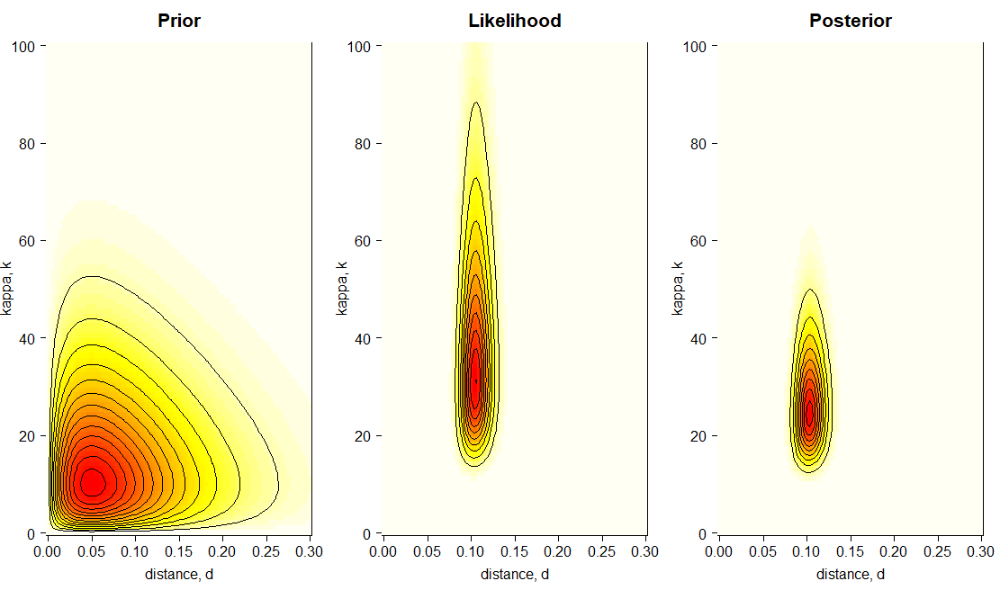
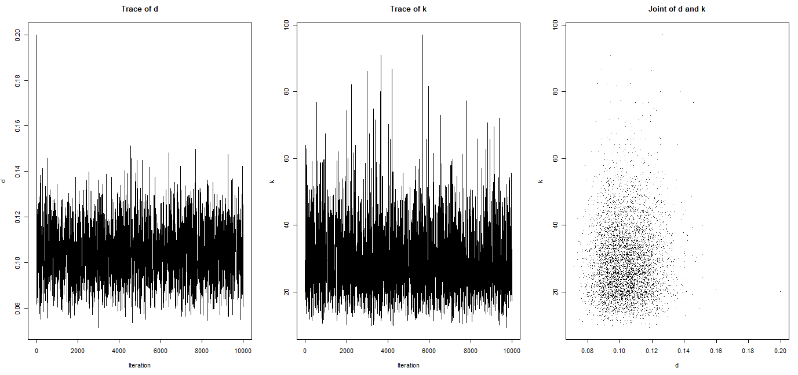
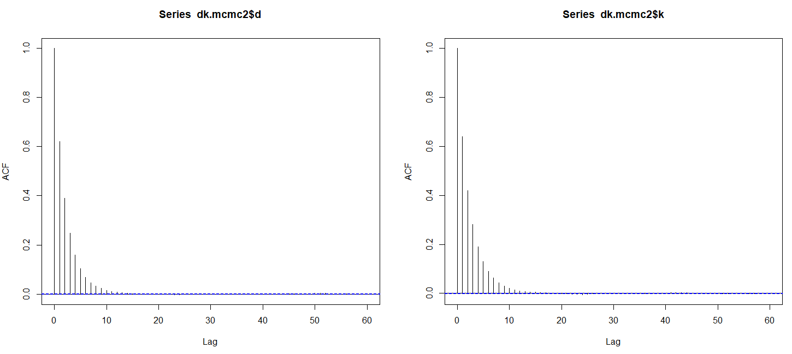
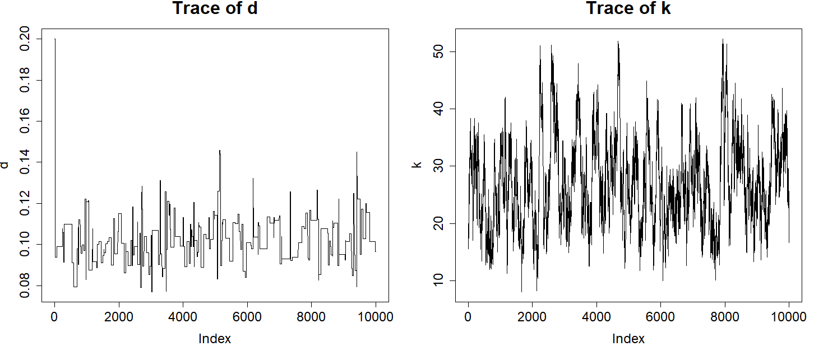
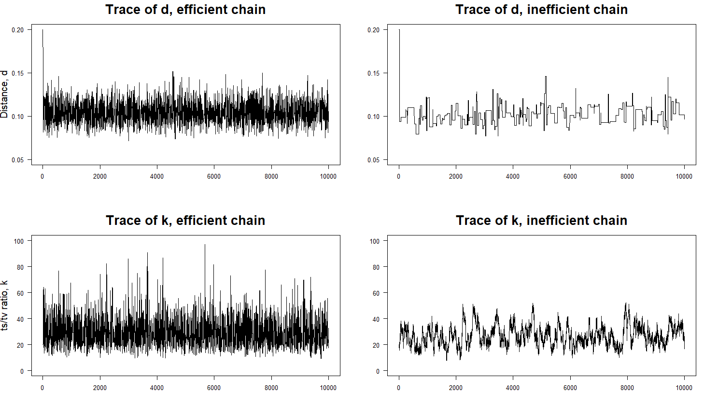
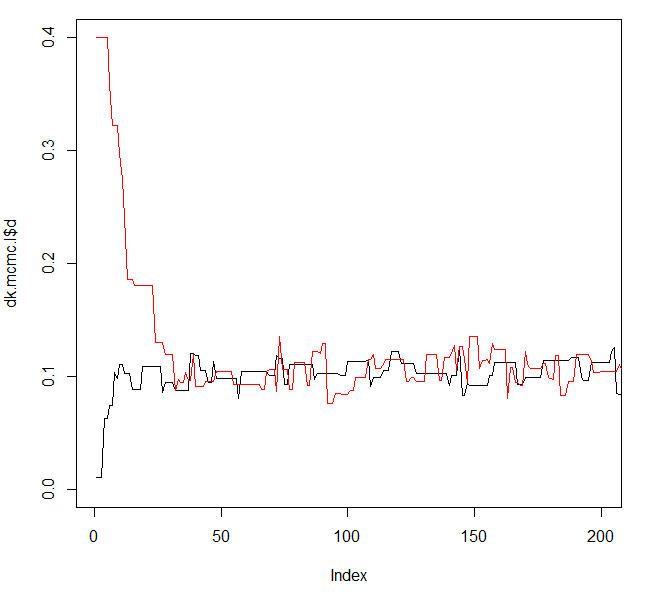
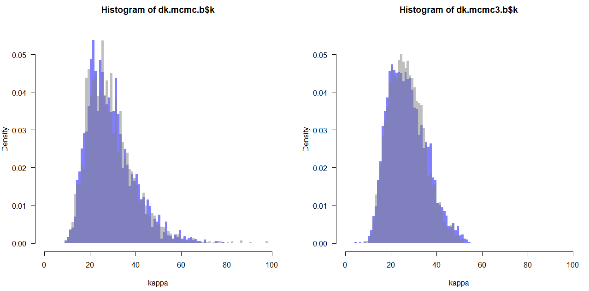
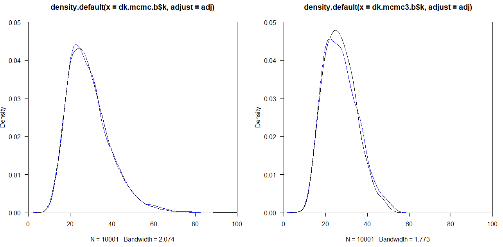

# Bayesian inference in R

## PART 1: Bayesian inference overview

### Introduction to the dataset

The data that we will be using for this practical session is the 12S rRNA alignment of human and orangutan, which consists of 948 base pairs and 90 differences (i.e., 84 transitions {"purine<->purine" or "pyrimidine<->pyrimidine"} and 6 transversions {"purine<->pyrimidine"};
purines are A and G and pyrimidines C and T):

> **Table 1**. Numbers and frequencies (in parantheses) of sites for the 16 site configurations (patterns) in human and orangutan mitochondrial 12s rRNA genes. This table is based on Table 1.3, page 7 in [Yang (2014)](http://abacus.gene.ucl.ac.uk/MESA/).

| Orangutan (below) \ Human (right)         | T               | C             | A              | G              | Sum ($\pi_{i}$)|
|-------------------------------------------|-----------------|---------------|----------------|----------------|----------------|
| T                                         | 179 (0.188819)  | 23 (0.024262) | 1 (0.001055)   | 0 (0)          | 0.2141         |
| C                                         | 30 (0.03164646) | 219 (0.231013)| 2 (0.002110)   | 0 (0)          | 0.2648         |
| A                                         | 2 (0.002110)    | 1 (0.001055)  | 291 (0.306962) | 10 (0.010549)  | 0.3207         |
| G                                         | 0 (0)           | 0 (0)         | 21 (0.022152)  | 169 (0.178270) | 0.2004         |
| Sum($\pi_{j}$)                            | 0.2226          | 0.2563        | 0.3323         | 0.1888         | 1              |

>> *Note*: GenBank accession numbers for the human and orangutan sequences are `D38112` and `NC_001646`, respectively ([Horai et al. (1995)](https://pubmed.ncbi.nlm.nih.gov/7530363/)). There are 954 sites in the alignment, but six sites involve alignment gaps and are removed, leaving 948 sites in each sequence. The average base frequencies in the two sequences are 0.2184 (T), 0.2605 (C), 0.3265 (A), and 0.1946 (G).

We are going to use the [R programming language](https://cran.r-project.org/) to load, parse, and analyse the data. You can also run all the commands we will go through in this tutorial from the graphical interface [RStudio](https://www.rstudio.com/products/rstudio/download/).
If you are unfamiliar with the installation of both these software, you can follow [this step-by-step tutorial](https://github.com/sabifo4/RnBash/tree/master/R_installation) for a detailed explanation of each task that you are going to carry out. Note that you can also find all the code shown and explained in this file in [this R script](Practical_1.R).

### Analysing the data

First, we will define the variables for our data set: the length of the alignment, the total number of transitions (i.e., A<->G or C<->T), and the total number of transversions (i.e., A<->T, G<->C, G<->T, A<->C):

```r
# Length of alignment in bp
n  <- 948
# Total number of transitions (23+30+10+21)
ns <- 84
# Total number of transversions (1+0+2+0+2+1+0+0)
nv <- 6
```

Then, we need to write a function that returns the log-likelihood given the distance between two sequences ($d$) and the transition/transversion rate ratio ($\kappa=\alpha/\beta$), which is written as $f(D|d,k)$. This function might change depending on the nucleotide substitution model
that is to be used. In this practical session, we will be using Kimura's 1980 (K80) nucleotide substitution model (see page 8, [Yang (2014)](http://abacus.gene.ucl.ac.uk/MESA/)), which accounts for the fact that transitions often occur at higher rates than transversions.
Therefore, the parameters to consider are the following:

* Distance, $d$.
* Kappa, $\kappa$.
* Alignment length, $n$. In this example, $n=948$.
* Number of transitions, $ns$. In this example, $ns=84$.
* Number of transversions, $nv$. In this example, $nv=6$.

```r
# Define log-likelihood function, f(D|d,k).
# This uses Kimura's (1980) substitution model. See p.8 in Yang (2014).
#
# Arguments:
#
#   d  Numeric, value for the distance.
#   k  Numeric, value for parameter kappa.
#   n  Numeric, length of the alignment. Default: 948.
#   ns Numeric, total number of transitions. Default: 84.
#   nv Numeric, total number of transversions. Default: 6.
k80.lnL <- function( d, k, n = 948, ns = 84, nv = 6 ) {

  # Define probabilities
  p0 <- .25 + .25 * exp( -4*d/( k+2 ) ) + .5 * exp( -2*d*( k+1 )/( k+2 ) )
  p1 <- .25 + .25 * exp( -4*d/( k+2 ) ) - .5 * exp( -2*d*( k+1 )/( k+2 ) )
  p2 <- .25 - .25 * exp( -4*d/( k+2 ) )

  # Return log-likelihood
  return ( ( n - ns - nv ) * log( p0/4 ) +
            ns * log( p1/4 ) + nv * log( p2/4 ) )

}
```

Once we have defined our log-likelihood function, we can now decide which values we want to use for $d$ and $\kappa$ (i.e., those values that we will input in the R function that we have just defined to calculate the log-likelihood). We are going to select 100 values for $\kappa$ that range from 0 to 100 and 100 values for $d$ that range from 0 to 0.3. Then, we can create a data frame that includes all possible combinations of the values selected for $d$ and $\kappa$:

```r
# Dimension for the plot
dim <- 100
# Vector of d values
d.v <- seq( from = 0, to = 0.3, len = dim )
# Vector of k values
k.v <- seq( from = 0, to = 100, len = dim )
dk  <- expand.grid( d = d.v, k = k.v )
```

The resulting data frame object has 10,000 rows and 2 columns, which means that 10,000 combinations for $d$ and $\kappa$ values have been recorded in this object.

Now, we can use this object to go through the matchings pairs of $d$ and $\kappa$ values so that we can compute the corresponding log-likelihood values with the `k80.lnL()` function previously defined. Last, we will save the output log-likelihood values in a matrix (i.e., object `lnL` below), which we will then transform into likelihood values scaled to 1:

```r
# Compute log-likelihood surface, f(D|d,k)
lnL <- matrix( k80.lnL( d = dk$d, k = dk$k ), ncol = dim )

# For numerical reasons, we take the exponential to
# get the likelihood, then scale it to be 1
# at the maximum, i.e., we subtract max(lnL)
L <- exp( lnL - max( lnL ) )
```

We have now computed the log-likelihood values for each pair of $d$ and $\kappa$ values provided! Before plotting the scaled likelihood surface, however, we can also compute the prior and the unscaled posterior surfaces for these same values so we can visually see how these surfaces change in the parameter space:

```r
# Compute prior surface, f(D)f(k)
Pri <- matrix( dgamma( x = dk$d, shape = 2, rate = 20 ) *
               dgamma( x = dk$k, shape = 2, rate = .1 ),
               ncol = dim )

# Compute unscaled posterior surface, f(d)f(k)f(D|d,k)
Pos <- Pri * L
```

Once we have computed the three surfaces, we can plot them!

```r
# Plot prior, likelihood, and unscaled posterior surfaces.
# We want one row and three columns.
par( mfrow = c( 1, 3 ) )
# Prior surface. Note that the `contour()` function creates a contour plot.
image( x = d.v, y = k.v, z = -Pri, las = 1, col = heat.colors( 50 ),
       main = "Prior", xlab = "distance, d",
       ylab = "kappa, k", cex.main = 2.0,
       cex.lab = 1.5, cex.axis = 1.5 )
contour( x = d.v, y = k.v, z = Pri, nlev=10, drawlab = FALSE, add = TRUE )
# Likelihood surface + contour plot.
image( x = d.v, y = k.v, z = -L, las = 1, col = heat.colors( 50 ),
       main = "Likelihood", xlab = "distance, d",
       ylab = "kappa, k", cex.main = 2.0,
       cex.lab = 1.5, cex.axis = 1.5 )
contour( x = d.v, y = k.v, z = L, nlev = 10,
         drawlab = FALSE, add = TRUE)
# Unscaled posterior surface + contour plot.
image( x = d.v, y = k.v, z = -Pos, las = 1, col = heat.colors( 50 ),
       main = "Posterior", xlab = "distance, d",
       ylab = "kappa, k", cex.main = 2.0,
       cex.lab = 1.5, cex.axis = 1.5 )
contour( x = d.v, y = k.v, z = Pos, nlev = 10,
         drawlab = FALSE, add = TRUE )
```

<p align="center">
  
</p>

## PART 2: Markov Chain Monte Carlo (MCMC)

### Introduction to MCMC

In most practical problems, constant $z$ cannot be calculated (either analytically or numerically), and so the MCMC algorithm becomes necessary.
In this case, we do not calculate the posterior as:

> $f(\kappa,d|D)=\frac{f(d)f(\kappa)f(D|d,\kappa)}{z}$

Instead, we **approximate** the posterior to be the product of the prior (in our case, we have two priors: the prior on $d$ and the prior on $\kappa$) and the likelihood. To calculate this **unscaled** posterior, we do the following:

> $f(\kappa,d|D)\propto f(d)f(\kappa)f(D|d,\kappa)$

The priors for $d$ and $\kappa$ are Gamma distributions, which depend on parameters $\alpha$ and $\beta$, i.e., $\Gamma(\alpha,\beta)$. E.g.:

> $f(d)=\Gamma(d|2,20)$, if $\alpha=2$ and $\beta=20$.
> $f(\kappa)=\Gamma(d|2,.1)$, if $\alpha=2$ and $\beta=0.1$.

We can write a function to compute the unscaled posterior, which we will later use when running the MCMC:

```r
# Define function that returns the logarithm of the unscaled posterior:
#                             f(d) * f(k) * f(D|d,k)
# By, default we set the priors as:
#                  f(d) = Gamma(d | 2, 20) and f(k) = Gamma(k | 2, .1)
#
# Arguments:
#
#   d     Numeric, value for the distance.
#   k     Numeric, value for parameter kappa.
#   n     Numeric, length of the alignment. Default: 948.
#   ns    Numeric, total number of transitions. Default: 84.
#   nv    Numeric, total number of transversions. Default: 6.
#   a.d.  Numeric, alpha value of the Gamma distribution that works as a prior
#         for the distance (d). Default: 2.
#   b.d.  Numeric, beta value pf the Gamma distribution that works as a prior
#         for parameter distance (d). Default: 20.
#   a.k.  Numeric, alpha value for the Gamma distribution that works as a prior
#         for parameter kappa (k). Default: 2.
#   b.k.  Numeric, beta value for the Gamma distribution that works as a prior
#         for parameter kappa (k). Default: 0.1.
ulnPf <- function( d, k, n = 948, ns = 84, nv = 6,
                   a.d = 2, b.d = 20, a.k = 2, b.k = .1 ){

  # The normalizing constant in the prior densities can be ignored
  lnpriord <- ( a.d - 1 )*log( d ) - b.d * d
  lnpriork <- ( a.k - 1 )*log( k ) - b.k * k

  # Define log-likelihood (K80 model)
  expd1 <- exp( -4*d/( k+2 ) )
  expd2 <- exp( -2*d*( k+1 )/( k+2 ) )
  p0 <- .25 + .25 * expd1 + .5 * expd2
  p1 <- .25 + .25 * expd1 - .5 * expd2
  p2 <- .25 - .25 * expd1
  lnL <- ( ( n - ns - nv ) * log( p0/4 ) + ns * log( p1/4 ) + nv * log( p2/4 ) )

  # Return unnormalised posterior
  return ( lnpriord + lnpriork + lnL )
}
```

### The MCMC algorithm

Once we have established the function to compute the unscaled posterior, we need to define the function that we will use to run our MCMC!
The algorithm that we will implement in this function has the following sections:

* Part A: First, set initial states for $d$ and $\kappa$.
* Part B: Now, for every $n_{th}$ iteration:
  1. Propose a new state $d^{*}$ (from an appropriate proposal density).
  2. Accept or reject the proposal with probability: $\mathrm{min}(1,p(d^{*})p(x|d^{*})/p(d)p(x|d))$. If the proposal is accepted, then $d=d^{*}$. Otherwise, the same state for $d$ is kept for the next iteration, $d=d$.
  3. Save $d$.
  4. Repeat steps 1-3 for $\kappa$.
  5. Go to step 1.

```r
# Define function with MCMC algorithm.
#
# Arguments:
#
#   init.d  Numeric, initial state value for parameter d.
#   init.k  Numeric, initial state value for paramter k.
#   N       Numeric, number of iterations that the MCMC will run.
#   w.d     Numeric, width of the sliding-window proposal for d.
#   w.k     Numeric, width of the sliding-window proposal for k.
mcmcf <- function( init.d, init.k, N, w.d, w.k ) {

  # We keep the visited states (d, k) in sample.d and sample.k
  # for easy plotting. In practical MCMC applications, these
  # are usually written into a file. These two objects are numeric
  # vectors of length N+1.
  sample.d <- sample.k <- numeric( N+1 )

  # STEP 1: Set initial parameter values to be used during the first
  #         iteration of the MCMC.
  # 1.1. Get initial values for parameters k and d. Save these values
  #      in vectors sample.d and sample.k
  d <- init.d;  sample.d[1] <- init.d
  k <- init.k;  sample.k[1] <- init.k
  # 1.2. Get unnormalised posterior
  ulnP  <- ulnPf( d = d, k = k )
  # 1.3. Initialise numeric vectors that will be used to keep track of
  #      the number of times proposed values for each parameter,
  #      d and k, have been accepted
  acc.d <- 0; acc.k <- 0
  # 1.4. Start MCMC, which will run for N iterations
  for ( i in 1:N ){

    # STEP 2: Propose a new state d*.
    # We use a uniform sliding window of width w with reflection
    # to propose new values d* and k*
    # 2.1. Propose d* and accept/reject the proposal
    dprop <- d + runif( n = 1, min = -w.d/2, max = w.d/2 )
    # 2.2. Reflect if dprop is negative
    if ( dprop < 0 ) dprop <- -dprop
    # 2.3. Compute unnormalised posterior
    ulnPprop <- ulnPf( d = dprop, k = k )
    lnalpha  <- ulnPprop - ulnP

    # STEP 3: Accept or reject the proposal:
    #            if ru < alpha accept proposed d*
    #            else reject and stay where we are
    if ( lnalpha > 0 || runif( n = 1 ) < exp( lnalpha ) ){
      d      <- dprop
      ulnP   <- ulnPprop
      acc.d  <- acc.d + 1
    }

    # STEP 4: Repeat steps 2-3 to propose a new state k*.
    # 4.1. Propose k* and accept/reject the proposal
    kprop <- k + runif( n = 1, min = -w.k/2, max = w.k/2 )
    # 4.2. Reflect if kprop is negative
    if ( kprop < 0 ) kprop <- -kprop
    # 4.3. Compute unnormalised posterior
    ulnPprop <- ulnPf( d = d, k = kprop )
    lnalpha  <- ulnPprop - ulnP
    # 4.4. Accept/reject proposal:
    #          if ru < alpha accept proposed k*
    #          else reject and stay where we are
    if ( lnalpha > 0 || runif( n = 1 ) < exp( lnalpha ) ){
      k     <- kprop
      ulnP  <- ulnPprop
      acc.k <- acc.k + 1
    }

    # STEP 5: Save chain state for each parameter so we can later
    #         plot the corresponding histograms
    sample.d[i+1] <- d
    sample.k[i+1] <- k
  }

  # Print out the proportion of times
  # the proposals were accepted
  cat( "Acceptance proportions:\n", "d: ", acc.d/N, " | k: ", acc.k/N, "\n" )

  # Return vector of d and k visited during MCMC
  return( list( d = sample.d, k = sample.k ) )

}
```

Before proceeding with the next steps, we can set a seed number so we can later reproduce the results that we get with the MCMCs that are to be run from this part of the tutorial until the end. You can omit running the next command if you want to get different results each time you run this tutorial:

```r
set.seed( 12345 )
```

### Running an MCMC

Before we run our MCMC function, we might want to estimate how long this might take. The function `system.time()` can be used for this purpose:

```r
# Test run-time
system.time( mcmcf( init.d = 0.2, init.k = 20, N = 1e4,
                    w.d = .12, w.k = 180 ) )
```

Once we have an estimate of the time it can take us to run an MCMC with specific settings (see R code above), we can run our function and save the output in an object:

```r
# Run MCMC and save output
dk.mcmc <- mcmcf( init.d = 0.2, init.k = 20, N = 1e4,
                  w.d = .12, w.k = 180 )
```

## PART 3: MCMC diagnostics

### Trace plots

The next step is very important: you need to make sure that your chain has converged and that there have been no issues during the sampling. For this purpose, we can use visual diagnostics such as plotting the traces of the sampled values during the $n$ iterations the chain ran:

```r
# Plot traces of the values sampled for each parameter
par( mfrow = c( 1,3 ) )
# Plot trace for parameter d
plot( x = dk.mcmc$d, ty = 'l', xlab = "Iteration",
      ylab = "d", main = "Trace of d" )
# Plot trace for parameter k
plot( x = dk.mcmc$k, ty = 'l', xlab = "Iteration",
      ylab = "k", main = "Trace of k" )
# Plot the joint sample of d and k (points sampled from posterior surface)
plot( x = dk.mcmc$d, y = dk.mcmc$k, pch = '.', xlab = "d",
      ylab = "k", main = "Joint of d and k" )
```

<p align="center">
  
</p>

>**QUESTION**: What would you say about these chains? Have they converged? As an additional exercise, you can change the starting parameter values, run an MCMC with the new settings, and then check for chain convergence. Does something change with your new settings?

### Autocorrelation Function (ACF) plots

Remember that values sampled in an MCMC are autocorrelated because the proposed state for the next iteration is either the current state
(i.e., the new proposed state during the current iteration is rejected, and thus the current state is kept for the next iteration) or a modification of such (i.e., the new state, which is proposed based on a distribution that uses the current state, is accepted to be used in the next iteration).

In addition, the efficiency of an MCMC chain is closely related to the autocorrelation. Intuitively, if the autocorrelation is high, the chain will be inefficient, i.e., we will need to run the chain for a long time to obtain a good approximation of the posterior distribution.

The efficiency of a chain is defined as:
> $eff=1/(1+2(r1+r2+r3+...))$

where $r_{i}$ is the correlation for lag $i$.

We are going to go through different examples with which we can evaluate chain efficiency.

First, we will run a very long chain and plot the corresponding autocorrelation function (ACF) for each parameter:

```r
# Run n=1e6 iterations
dk.mcmc2 <- mcmcf( init.d = 0.2, init.k = 20, N = 1e6,
                   w.d = .12, w.k = 180 )

# Plot ACF for each parameter
par( mfrow = c( 1,2 ) )
acf( x = dk.mcmc2$d )
acf( x = dk.mcmc2$k )
```

<p align="center">
  
</p>

>**QUESTION**: What can you say about this MCMC run by looking at these ACF plots?

### Chain efficiency

Apart from calculating and plotting the ACF, we can also calculate chain efficiency. For this purpose, we use the following function:

```r
# Define efficiency function
#
# Arguments:
#  acf  Numeric, autocorrelation value
eff <- function( acf ) 1 / ( 1 + 2 * sum( acf$acf[-1] ) )
```

As we have saved the sampled values from the chain previously run in object `dk.mcmc2`, we can now compute the corresponding chain efficiency:

```r
# Compute efficiency
eff( acf = acf( dk.mcmc2$d ) )
eff( acf = acf( dk.mcmc2$k ) )
```

>**QUESTION**: What can you say about this chain with regards to the efficiency values you have just computed?

### Time to practice

#### Example 1

We will now run another MCMC but, this time, using a proposal density with a too large step size for parameter $d$ and another with a too small step size for parameter $\kappa$:

```r
dk.mcmc3 <- mcmcf( init.d = 0.2, init.k = 20, N = 1e4,
                   w.d = 3, w.k = 5 )
```

When the MCMC has finished, we can plot the corresponding traces for each parameter:

```r
# Plot traces for each parameter.
par( mfrow = c( 1,2 ) )
plot( x = dk.mcmc3$d, ty = 'l', main = "Trace of d", cex.main = 2.0,
      cex.lab = 1.5, cex.axis = 1.5, ylab = "d" )
plot( x = dk.mcmc3$k, ty = 'l', main = "Trace of k", cex.main = 2.0,
      cex.lab = 1.5, cex.axis = 1.5, ylab = "k" )
```

<p align="center">
  
</p>

>**QUESTION**: What can you say about chain efficiency when using these parameters?

#### Example 2

Now, we run the chain longer but keep the same starting values for the rest of the parameters. Then, we compute the chain efficiency for each
parameter:

```r
# Run MCMC
dk.mcmc4 <- mcmcf( init.d = 0.2, init.k = 20, N = 1e6,
                   w.d = 3, w.k = 5 )
# Compute efficiency values
eff( acf = acf( dk.mcmc4$d, lag.max = 2e3 ) )
eff( acf = acf( dk.mcmc4$k, lag.max = 2e3 ) )

# Plot the traces for efficient (part 2) and inefficient chains.
par( mfrow = c( 2,2 ) )
plot( dk.mcmc$d, ty = 'l', las = 1, ylim = c( .05,.2 ),
      main = "Trace of d, efficient chain", xlab = '',
      ylab = "Distance, d", cex.main = 2.0, cex.lab = 1.5 )
plot( dk.mcmc3$d, ty = 'l', las = 1, ylim = c( .05,.2 ),
      main = "Trace of d, inefficient chain", xlab='',
      ylab = '', cex.main = 2.0, cex.lab = 1.5 )
plot( dk.mcmc$k, ty = 'l', las = 1, ylim = c( 0,100 ),
      main = "Trace of k, efficient chain",
      xlab = '', ylab = "ts/tv ratio, k",
      cex.main = 2.0, cex.lab = 1.5 )
plot( dk.mcmc3$k, ty = 'l', las = 1, ylim = c( 0,100 ),
      main = "Trace of k, inefficient chain",
      xlab = '', ylab = '', cex.main = 2.0, cex.lab = 1.5 )
```

<p align="center">
  
</p>

>**QUESTION**: What differences can you observe after running the chain longer?

#### Example 3

We will now run two different chains: one with a high starting value for parameters $d$ and $\kappa$ and another with a low starting value for these two parameters:

```r
# Run MCMCs with high/low starting values for parameters d and k.
dk.mcmc.l <- mcmcf( init.d = 0.01, init.k = 20, N = 1e4,
                    w.d = .12, w.k = 180 )
dk.mcmc.h <- mcmcf( init.d = 0.4, init.k = 20, N = 1e4,
                    w.d = .12, w.k = 180 )
```

Now, we can compute the mean and the standard deviation of parameter $d$. Below, we show you how this can be done when using the "low" chain, although we could have used the "high" chain too:

```r
# Compute mean and sd for d
mean.d <- mean( dk.mcmc.l$d )
sd.d   <- sd( dk.mcmc.l$d )
```

Now, we can plot the two chains, "low" and "high", to observe how the chains move from either the high or low starting values towards the  
stationary phase (the area within the dashed lines). The area before it reaches stationarity is what we call the "burn-in" phase:

```r
# Plot the two chains 
plot( dk.mcmc.l$d, xlim = c( 1,200 ), ylim = c( 0,0.4 ), ty = "l" )
lines( dk.mcmc.h$d, col = "red" )
# Plot a horizontal dashed line to indicate (approximately)
# the 95% CI.
abline( h = mean.d + 2 * c( -sd.d, sd.d ), lty = 2 )
```

<p align="center">
  
</p>

#### Example 4

We are going to run two chains with different starting values so we can compare their efficiency:

```r
# Run an efficient chain (i.e., good proposal step sizes)
dk.mcmc.b <- mcmcf( init.d = 0.05, init.k = 5, N = 1e4,
                    w.d = .12, w.k = 180 )

# Run an inefficient chain (i.e., bad proposal step sizes)
dk.mcmc3.b <- mcmcf( init.d  = 0.05, init.k = 5, N = 1e4,
                     w.d = 3, w.k = 5 )

# Plot and compare histograms
# Set breaking points for the plot
bks <- seq(from=0, to=150, by=1)
# Start plotting
par( mfrow = c( 1,2 ) )
hist( x = dk.mcmc.b$k, prob = TRUE, breaks = bks, border = NA,
      col = rgb( 0, 0, 1, .5 ), las = 1, xlab = "kappa",
      xlim = c( 0,100 ), ylim = c( 0,.055 ) )
hist( x = dk.mcmc$k, prob=TRUE, breaks=bks, border=NA,
      col=rgb(.5, .5, .5, .5), add=TRUE)
hist( x = dk.mcmc3.b$k, prob=TRUE, breaks=bks, border=NA,
      col=rgb(0, 0, 1, .5), las=1, xlab="kappa",
      xlim=c(0,100), ylim=c(0,.055))
hist( x = dk.mcmc3$k, prob=TRUE, breaks=bks, border=NA,
      col=rgb(.5, .5, .5, .5), add=TRUE)
```

<p align="center">
  
</p>

Now, as we did in the previous example, we will compute the mean and the standard deviation for each chain. Then, we will plot the corresponding densities so it is easier to see which chains are more or less efficient:

```r
# A) Calculate the posterior means and s.d for each chain.
# Compute means for efficient chains (they are quite similar)
mean( dk.mcmc$d ); mean( dk.mcmc.b$d )
mean( dk.mcmc$k ); mean( dk.mcmc.b$k )
# Compute means for inefficient chains (not so similar)
mean( dk.mcmc3$d ); mean( dk.mcmc3.b$d )
mean( dk.mcmc3$k ); mean( dk.mcmc3.b$k )
# Standard error of the means for efficient chains
sqrt( 1/1e4 * var( dk.mcmc$d ) / 0.23 ) # roughly 2.5e-4
sqrt( 1/1e4 * var( dk.mcmc$k ) / 0.20 ) # roughly 0.2
# Standard error of the means for inefficient chain
sqrt( 1/1e4 * var( dk.mcmc3$d ) / 0.015 ) # roughly 9.7e-4
sqrt( 1/1e4 * var( dk.mcmc3$k ) / 0.003 ) # roughly 1.6

# B) Plot densities (smoothed histograms) for the efficient and
#    inefficient chains.
# Set value to scale the kernel densities for the MCMCs
adj <- 1.5
par( mfrow = c( 1,2 ) )
# Efficient chains
plot( x = density( x = dk.mcmc.b$k, adjust = adj ), col = "blue", las = 1,
      xlim  = c( 0, 100 ), ylim = c( 0, .05 ), xaxs = "i", yaxs = "i" )
lines( x = density( x = dk.mcmc$k, adjust = adj ), col = "black" )
# Inefficient chains
plot( x = density( dk.mcmc3.b$k, adjust = adj ), col = "blue", las = 1,
      xlim = c(0, 100), ylim = c( 0, .05 ), xaxs = "i", yaxs = "i" )
lines( x = density( x = dk.mcmc3$k, adjust = adj ), col = "black" )
```

<p align="center">
  
</p>

---

This is the end of this tutorial! Now, let's have a break and we shall resume to learn more about [phylogeny inference with `MrBayes`](../01_MrBayes/README.md)!
