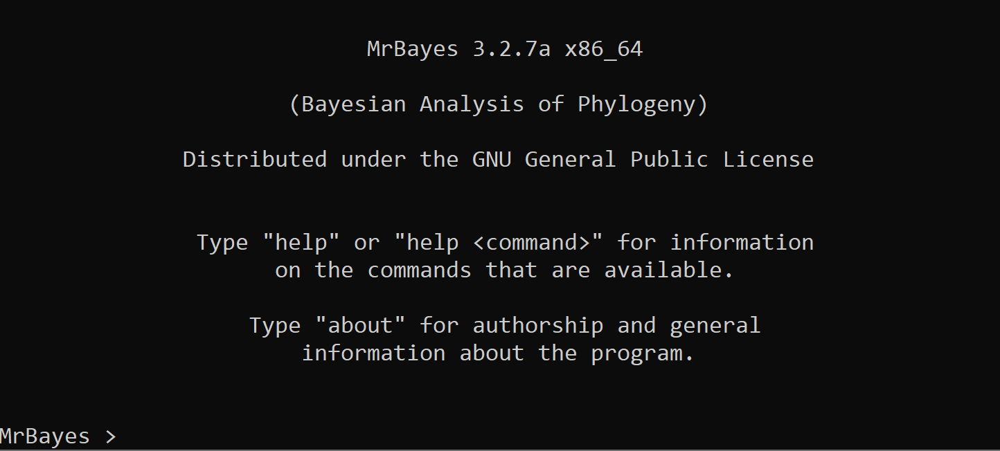

# Bayesian phylogeny inference with `MrBayes`

For this tutorial, we assume that you have already installed `MrBayes` ([Ronquist et al., 202012](https://academic.oup.com/sysbio/article/61/3/539/1674894)) on your PC or that, alternatively, you will be using the cluster, where this program is already installed. If you want to install `MrBayes` on your PC, please follow the instructions on their [GitHub repository](https://github.com/NBISweden/MrBayes).

We will divide this practical session into the following sections:

* Getting familiar with the commands in `MrBayes`.
* Running `MrBayes`.
* Learning how to use `Tracer` for MCMC diagnostics.
* Learning how to use `FigTree` to visualise inferred phylogenies.
* _ADDITIONAL EXERCISE IF TIME ALLOWS_: Evaluating the effect that using different models can have on posterior parameter estimates.

Now... Let's get started!

> **DISCLAIMER**: The dataset you will analyse during this practical session is part of a `MrBayes` practical that was run during the [Computational Molecular Evolution course](https://coursesandconferences.wellcomeconnectingscience.org/event/computational-molecular-evolution-20240518/) I attended in 2017. I have followed [the `MrBayes` documentation](https://github.com/NBISweden/MrBayes/blob/develop/doc/manual/Manual_MrBayes_v3.2.pdf) to write this tutorial, which is adapted to a specific example dataset. Nervertheless, note that you will always find more details about the software and other settings [in the main documentation](https://github.com/NBISweden/MrBayes/blob/develop/doc/manual/Manual_MrBayes_v3.2.pdf) and [the GitHub repository where the program is hosted](https://github.com/NBISweden/MrBayes).

## 1. Getting familiar with the NEXUS format

### Input data

First, we will be looking at the different commands needed to define our alignment in NEXUS format. In [directory `data`](data), you will find a NEXUS file called [`conifer_dna.nex`](data/conifer_dna.nex). You can visualise this file here on the GitHub repository or, if you have cloned this repository, you may open this file with your preferred text editor. The main commands to be highlighted are the following:

* `begin data`: this command specifies the beginning of the data block. More details [in the `MrBayes` documentation](https://github.com/NBISweden/MrBayes/blob/develop/doc/manual/Manual_MrBayes_v3.2.pdf).
* `dimensions`: after this command, you define the number of taxa (`ntax`) and the number of characters in your alignment (`nchar`). More details [in the `MrBayes` documentation](https://github.com/NBISweden/MrBayes/blob/develop/doc/manual/Manual_MrBayes_v3.2.pdf).
* `format`: this command specifies the type of data of your alignment (`datatype`), e.g., DNA, AA, RNA, etc. You can also indicate if it is interleaved or not. More details [in the `MrBayes` documentation](https://github.com/NBISweden/MrBayes/blob/develop/doc/manual/Manual_MrBayes_v3.2.pdf).
* `matrix`: after this command (normally next line), you need to include the alignment. Interleave format is accepted as aforementioned. More details [in the `MrBayes` documentation](https://github.com/NBISweden/MrBayes/blob/develop/doc/manual/Manual_MrBayes_v3.2.pdf).
* `end`: this command terminates the data block.

>> **NOTES:**: Add a `;` to terminate a command (i.e., `begin data;`). If you do not add a semicolon, `MrBayes` will understand that all the information/arguments you add until the next `;` are part of the last settings block despite being in a new line! In addition, whatever information you add within square brackets is treated as a comment, and thus `MrBayes` does not execute it. Please use the square brackets to add useful comments in your NEXUS files, which will always help you remember what each settings block corresponds to :)
>> Example of a comment in the NEXUS control file to be read by `MrBayes`: `[ this is a comment and it is not run by MrBayes ]`.

### `MrBayes` commands

Once we have defined our input alignment in NEXUS format, we can generate the control file that will execute `MrBayes`, which will also be in NEXUS format. You can find a template control file in [directory `data`](data/ctl_mrabyes.nex), which you can visualise either in this GitHub repository or with your favourite text editor. Below, you will find a summary of the commands that we will go through:

**BLOCK 1: Start `MrBayes` and read input data**:

* `begin mrbayes`: this command initiates the block with instructions to run `MrBayes`.
* `log`: this command specifies that you want a log file where all the screen messages printed out by the program will be saved. You can specify your preferred file name (`filename`) and whether you want to append new content or replace the old content with new (`append/replace`). You start or stop this command by including the option `start` or `stop`, respectively. More details [in the `MrBayes` documentation](https://github.com/NBISweden/MrBayes/blob/develop/doc/manual/Manual_MrBayes_v3.2.pdf).
* `execute`: this command is used to let `MrBayes` know that you want it to read your input alignment file, which you have previously prepared.
* `outgroup`: use this command to write down the name of the taxon/taxa that are to be used as an outgroup.

**BLOCK 2: Define analysis in `MrBayes`**:

* `charset`: this command is used to specify different datasets that you want to analyse based on your pre-defined input alignment. For instance, you may have two genes which could be labelled with a specific tag and which number of nucleotide bases is defined. This command can also be useful if you decide to partition your dataset and give a specific tag to each alignment block.  The format followed is the following: `charset <name_set>=<start_pos>:<end_pos>`.
* `partition`: this command uses the information you have passed to `charset` and the names you gave to each character set. The format followed is the following: `partition <name_partition> = <num_partitions>:<name_charset1>, ...,<name_chraset_n`. E.g.:

  ```text
  # Example 1: separate a concatenated alignment into two genes.
  # The first 500 nucleotides correspond to the first gene, the
  # other 500 to a second gene.
  charset gene1=1-500;   
  charset gene2=501-1000;
  partition by-gene=2: gene1, gene2;   
  ```

  ```text
  # Example 2: separate a concatenated alignment into two genes.
  # The first 500 nucleotides correspond to the first gene, the
  # other 500 to a second gene. In addition, separate each codon
  # position of the first gene
  charset gene1_cp1=1-500\3;   
  charset gene1_cp2=2-500\3;   
  charset gene1_cp3=3-500\3;   
  charset gene2=501-1000;
  partition by-codpos=2: gene1_cp1, gene1_cp2, gene1_cp3, gene2;   
  ```

  More details [in the `MrBayes` documentation](https://github.com/NBISweden/MrBayes/blob/develop/doc/manual/Manual_MrBayes_v3.2.pdf).

* `set`: this command is to be used if you have used the `partition` command as it "sets up" what you previously defined.
* `lset`: this command sets the parameters of the likelihood model. There are different options this command can take, but we will focus on `nst`, `applyto`, and `rates`. More details [in the `MrBayes` documentation](https://github.com/NBISweden/MrBayes/blob/develop/doc/manual/Manual_MrBayes_v3.2.pdf).
* `prset`: use this command to set the priors for the phylogenetic model you want to use. This command enables various options, but we will focus on `statefreqpr`, `shapepr`, and `revmatpr`. More details [in the `MrBayes` documentation](https://github.com/NBISweden/MrBayes/blob/develop/doc/manual/Manual_MrBayes_v3.2.pdf).
* `unlink`: this command is to be used when you enable the `partition` command. As the name of this command says, it will "unlink" model parameters across the data partitions you have defined. You can type `all` or the specific name of the partition/s for which you want to unlink the model parameters. By default, if the same parameter applies to different partitions and if this parameter has the same prior, `MrBayes` will use a single value for this parameter. If you want to use different parameter values for each partition you have established, then you need to use this command to "unlink" the model parameters, and specific parameter values will be inferred for each partition. If you use the command `link` instead of `unlink`, the opposite will occur. More details [in the `MrBayes` documentation](https://github.com/NBISweden/MrBayes/blob/develop/doc/manual/Manual_MrBayes_v3.2.pdf).
* `mcmc`: this command is used to set up and start the MCMC analysis. There are different options this command can activate, but we will focus on `seed`, `ngen`, `nruns`, `nchains` (default is 4, 1 cold chain and 3 heated chains), `printfreq`, `samplefreq`, `diagnfreq`, `diagnstat`, `savebrlens`, and `filename`. More details [in the `MrBayes` documentation](https://github.com/NBISweden/MrBayes/blob/develop/doc/manual/Manual_MrBayes_v3.2.pdf).

**BLOCK 3: Summarise trees and other model parameters (as many blocks as analysis you want to perform!)**:

* `sumt`: this command produces summary statistics for the trees that have been sampled during the MCMC. You can specify the file name (`filename`) where you want the output to be written. By default, the burnin is established to be 25% of the samples collected (you could modify this, if required). More details [in the `MrBayes` documentation](https://github.com/NBISweden/MrBayes/blob/develop/doc/manual/Manual_MrBayes_v3.2.pdf).
* `sump`: this command prints the values that have been sampled for the model parameters during the MCMC. You can specify the file name (`filename`) where you want the output to be written. By default, the burnin is established to be 25% of the samples collected (you could modify this if required). More details [in the `MrBayes` documentation](https://github.com/NBISweden/MrBayes/blob/develop/doc/manual/Manual_MrBayes_v3.2.pdf).

**BLOCK 4: Stop `MrBayes` and end of nexus file**:

* `quit`: this command exits `MrBayes`.
* `end`: this command is used to indicate that the `MrBayes` block has come to an end.

## 2. Run `MrBayes`

Now, we would be ready to run `MrBayes`! To save computational power, however, there is no need for you to run this analysis! You can download the results that have already been generated so that you can later inspect the MCMC output. We will also learn how to use `Tracer` and `FigTree` to analyse and visualise the results you have obtained!

```sh
# Run from `01_MrBayes/analysis
tar -xvf mrbayes_output.tar.gz
#> You will now see many output files corresponding
#> to the different analyses we pre-defined in the
#> control file!
```

>> If you are a Windows user and want to use the executable file for future analyses, you may want to copy this file in the directory where you have saved the control and alignment files in NEXUS format. Once saved in the same location, you will be able to execute `MrBayes` there. If you are running `MrBayes` from the command line and you have properly installed the software, you can open a terminal from the directory where you have your NEXUS files and type `mb` to start `MrBayes`. In both cases, you should see the following screen:

<p align="center">
  
</p>

## 3. Analysing the `MrBayes` MCMC output

To analyse the MCMC output, we are going to use the program `Tracer`. [You can download the latest pre-compiled binaries, Tracer v1.7.2, from the Tracer GitHub repository](https://github.com/beast-dev/tracer/releases/tag/v1.7.2).

Run `Tracer` by double clicking on the `Tracer` icon. If you want to run `Tracer` from the command line, you can either (i) set an alias in your `~/.bashrc` or `~/.bash_profile` file, (ii) execute the program from the directory where the `jar` file can be found, or (iii) execute this `jar` file using an absolute or a relative path to the directory where the terminal is running. Below, you can find a summary of how you would proceed for each of these three options when using the terminal:

```sh
# Option 1: Run from the directory where 
# `tracer.jar` can be found. For instance, 
# if you open a terminal from
# `Tracer_v1.7.1/lib`, then:
java -jar tracer.jar

# Option 2: Use an absolute or a relative 
# path to execute the file. An example of 
# an absolute path is shown below:
java -jar Applications/Tracer_v1.7.1/lib/tracer.jar

# Option 3: Add an alias in your 
# `~/.bashrc` or `~/.bash_profile.
# Please replace "<path_to_Tracer>" with the absolute path
# to the location where you have saved `Tracer`
# Modify the name of the directory that you have unzipped
# if needed too (e.g., `Tracer_v1.7.1`)
alias tracer1.7.1='java -jar <path_to_Tracer>/Tracer_v1.7.1/lib/tracer.jar'
# Now, open a terminal from any location on 
# your PC and type the following command to 
# execute `Tracer`. Before you do this, please 
# make sure that you have X11 installed or, if 
# you are on Windows, that you have the Xming 
# Server running on your PC.
# If you are on Windows, you might need to run 
# the command `export DISPLAY=:0.0` before 
# you can execute `Tracer`
tracer1.7.1
```

You can open the output files that have saved the samples collected during the MCMC for all model parameters (i.e., files which extension is `.p`).

Once you have launched `Tracer`, you can select the `Import Trace File...` option from the `File` menu. Then, select the file with extension `.p` that was output by `MrBayes` to load it onto `Tracer`. Alternatively, you can also drag the file onto the `Tracer` icon if you are on your PC.

We will go through the most important features of `Tracer` together but, in general, we will focus on the effective sample sizes (ESSs) calculated for each of the model parameters, the frequency plot of the samples, and the trace plots.

> **QUESTIONS**:
>
> * Do you think we need to run the chain longer?
> * Is the ESS enough for the model parameters?
> * How efficient is the chain?
> * Do we need to increase the number of iterations that are part of the burn-in phase?

## 4. Viewing the annotated tree

`FigTree` is a user-friendly, graphical program for viewing trees. You can download [the latest pre-compiled binaries, FigTree v1.4.4, from the FigTree GitHub repository](https://github.com/rambaut/figtree/releases).

If you want to run `FigTree` from the command line, you can either (i) set an alias in your `~/.bashrc` or `~/.bash_profile` file, (ii) run it from the directory where the `jar` file can be found, or (iii) execute this `jar` file using an absolute or a relative path to the directory where the terminal is running. Below, you can find a summary of how you would proceed for each of these three options when using the terminal:

```sh
# Option 1: Run from the directory where 
# `figtree.jar` can be found. For instance, 
# if you open a terminal from
# `FigTree_v1.4.4/lib`, then:
java -jar figtree.jar

# Option 2: Use an absolute or a relative 
# path to execute the file. An example of 
# an absolute path is shown below:
java -jar Applications/FigTree_v1.4.4/lib/figtree.jar

# Option 3: Add an alias in your 
# `~/.bashrc` or `~/.bash_profile.
# Please replace "<path_to_FigTree>" with the absolute path
# to the location where you have saved `FigTree`
# Modify the name of the directory that you have unzipped
# if needed too (e.g., `FigTree_v1.4.4`)
alias figtree1.4.4='java -jar <path_to_Tracer>/FigTree_v1.4.4/lib/figtree.jar'
# Now, open a terminal from any location on 
# your PC and type the following command to 
# execute `FigTree`. Before you do this, please 
# make sure that you have X11 installed or, if 
# you are on Windows, that you have the Xming 
# Server running on your PC.
# If you are on Windows, you might need to run 
# the command `export DISPLAY=:0.0` before 
# you can execute `FigTree`
figtree1.4.4
```

Now, you can launch `FigTree` to view the file with the consensus tree that `MrBayes` has output, i.e., file names that end with `con.tre`. The tree will be displayed in the `FigTree` window. On the left hand side, you can find the options and settings which control how the tree is displayed. We will see together the main options you can use to display the tree.

---

## 5. ADDITIONAL EXERCISE **ONLY** IF WE HAVE FINISHED EARLIER

Come up with 2 different models under which you could run `MrBayes` and analyse the example data set we have shown above. Once you have decided which models you are going to run in `MrBayes`, set up your control file in NEXUS format and start the Bayesian inference analysis. You can then compare the results you obtain with those we have run together to see which one fits the data better.
