# `BEAST` tutorial : Exploring the evolutionary dynamics of influenza 

> **IMPORTANT NOTE**: The tutorial we are going to be going through is based on the tutorial provided by
> the [`BEAST` community](https://beast.community/index.html) on their website, which you can access [here](https://beast.community/workshop_influenza_phylodynamics).
> If you have not been able to download the dataset we will be using in this practical 
> session, please download it from [here](https://beast.community/tutorials/workshop_influenza_phylodynamics/files/influenzaTutorialFiles.zip).
> Then, uncompress this file in your preferred location - remember where you have saved 
> the uncompressed directory as it contains the datasets we will be using.

## 1. Running `BEAUti` to generate your `BEAST` XML file
### Converting the data 
To load a NEXUS format alignment, you can open `BEAUti` and click `File> Import Data…`. 
Then, navigate through your file system until you find the directory where you saved 
the uncompressed file with the datasets that are to be used in the practical (i.e., 
see section above, which contains the link to download it). We will now load the file called 
`H1N1pdm_20009.nex`. Please select this file, which contains an alignment of 50 genomes
(all 8 genomic segments concatinated), 13,109 nucleotides in length. Once this is loaded, 
you will see it is listed on the graphical interface 

<p align="center">
  
</p>

### Setting the tip dates
To undertake a phylodynamic analysis we need to specify the dates that the individual
viruses were collected. In this case, the sequences were sampled from the H1N1 2009
pandemic between March and May 2009. To set these dates, click the `Tips` tab at the top 
panel displayed in `BEAUti`. Now, select the box labelled `Use tip dates`.
The actual sampling time in fractional years is encoded in the name of each taxon and we
can use the `Parse Dates` button (top of the panel) to extract these.
For the `H1N1pdm_2009` sequences, you can keep the default `Defined just by its order`
and select `last` from the drop-down menu for the order and press `OK`.
The dates will appear in the appropriate column of the main window.
You can then check these and edit them manually as required:

<p align="center">
  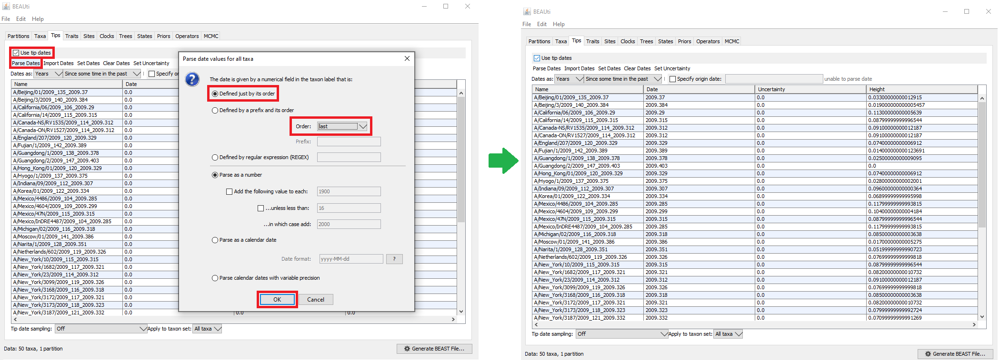
</p>
 
>> **NOTE**: There are many other options for reading and parsing tip dates in different
>> formats (see [here](https://beast.community/tip_dates.html) for more information).

### Setting the nucleotide substitution model
Then, we will click on the `Sites` tab at the top of the main window to specify the
evolutionary model settings for `BEAST`.
 
For this tutorial, keep the default `HKY` model, the default `Estimated` base frequencies
and select `Gamma` as `Site Heterogeneity Model` (with `4` discrete categories) before
proceeding to the next step. 

<p align="center">
  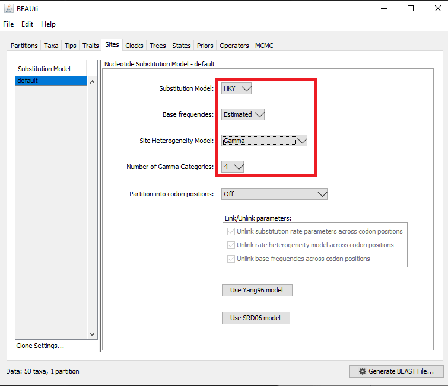
</p>
 
### Setting the molecular clock model
The `Clocks` tab has a button next to the `Clock Type` option where you can choose 
between a strict clock, an uncorrelated relaxed clock, a random local clock, or a fixed
local clock. 

Because of the low diversity data we analyse here, a relaxed-clock model would probably
be an over-parameterisation. Hence, we selecte the strict-clock model.

<p align="center">
  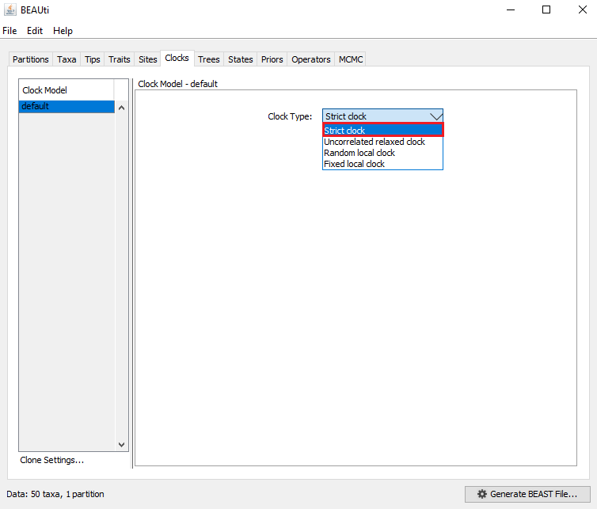
</p>

### Setting the tree prior
Now, we move on to the `Trees` tab. Here, you can define the settings about 
the tree. First, the starting tree is specified to be "randomly generated". The other
main setting here is to specify the "Tree prior", which describes how the population size
is expected to change over time for coalescent models. The default tree prior is set to a
constant size coalescent prior. The range of different tree priors (coalescent and other
models) are described on this page.

To estimate the epidemic growth rate, we will change this demographic model to an
exponential growth coalescent prior, which is intuitively appealing for viral outbreaks.
For option `Tree Prior`, select `Exponential Growth`:

<p align="center">
  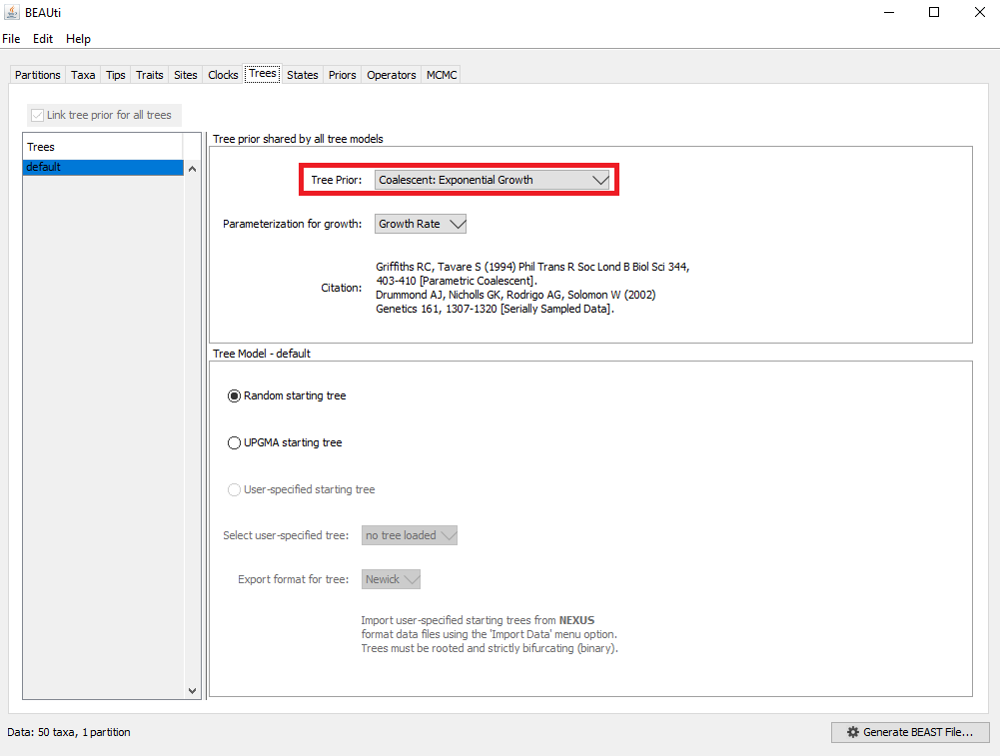
</p>

### Setting up the priors
To establish the priors for each parameter in the model, we will switch to the
`Priors` tab. This panel has a table showing every parameter of the currently selected
model and what the prior distribution is for each. A strong prior allows the user to
"inform" the analysis by selecting a particular distribution with a small variance.
Alternatively we can select a weak (diffuse) prior to try to minimise the effect on the
analysis. Note that a prior distribution must be specified for every parameter and, whilst
`BEAUti` provides default options, these are not necessarily tailored to the problem and
data being analysed.
 
In this example, the default prior for the exponential growth rate (the Laplace
distribution) prefers relatively small growth rates because of the default scale
($\lambda=1.0$). On this epidemic scale, however, the growth rate parameter could
take on relatively large values. Therefore, we will increase the variance of this prior
distribution by setting the scale to 100. 
The other priors can be left at their default options.

<p align="center">
  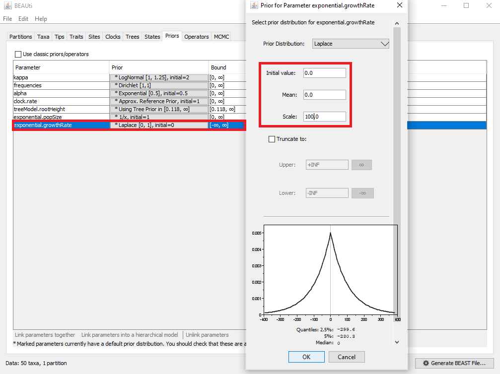
</p>

>> **NOTE**: A useful exercise could be to examine the sensitity of the growth rate
>> estimates to different scale values for this prior distribution (e.g. scale = 1, 10,
>> 100). We will assess the impact that changing the prior according to the scale values 
>> if time allows at the end of this tutorial!

### Setting up the operators
Each parameter in the model has one or more "operators" (i.e., variously called moves, 
proposals, or transition kernels by other MCMC software packages such as `MrBayes` or
`LAMARC`). The operators specify how the parameters change as the MCMC runs. 
The `Operators` tab in `BEAUti` has a table that lists the parameters that are included 
in the model, their operators, and the tuning settings for these operators.
 
Note that the coalescent growth rate parameter (`exponential.growthrate`) has a 
`randomWalk` operator. This is appropriate for a parameter that can take both positive
and negative values (parameters that are strictly positive can use a scale operator).
For this example, we can leave all the options as displayed, no changes are required 
for the options listed here.

<p align="center">
  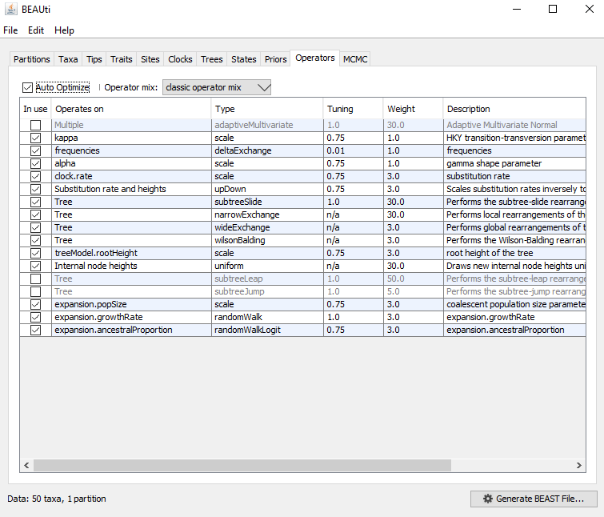
</p>

### Setting the MCMC options
The `MCMC` tab in `BEAUti` is used to define the settings that control the MCMC and the log 
files that are generated.
 
For this daset, we will set the chain length to 100,000. Then, we choose 
to display the state being sampled 100 iterations. We use the same sampling frequency, 100,
to log the values sampled for each parameter. 

The `File name stem` should already be set to `H1N1pdm_2009`, but you can modify this if required
(e.g., you may want to add more information about the analysis).

<p align="center">
  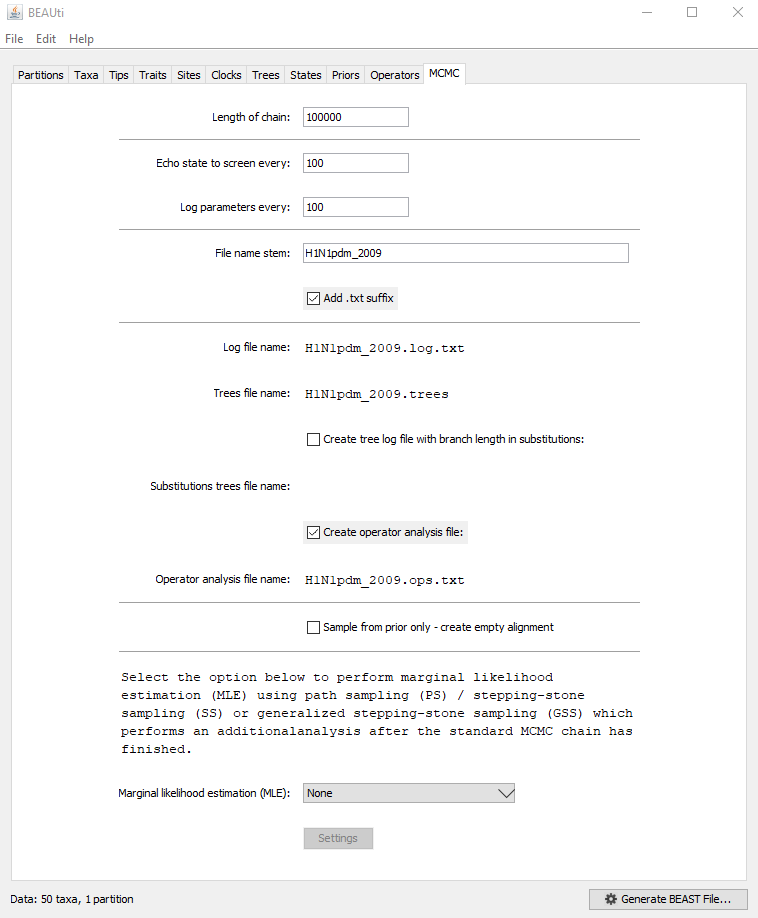
</p>

Now, we are ready to create the `BEAST` XML file. Select `Generate BEAST file...` from the
`File menu` or just click on the button with the same name at the bottom of the window.
`BEAUti` will then ask you to review the prior settings one more time before saving the file
(and will indicate if any are improper):

<p align="center">
  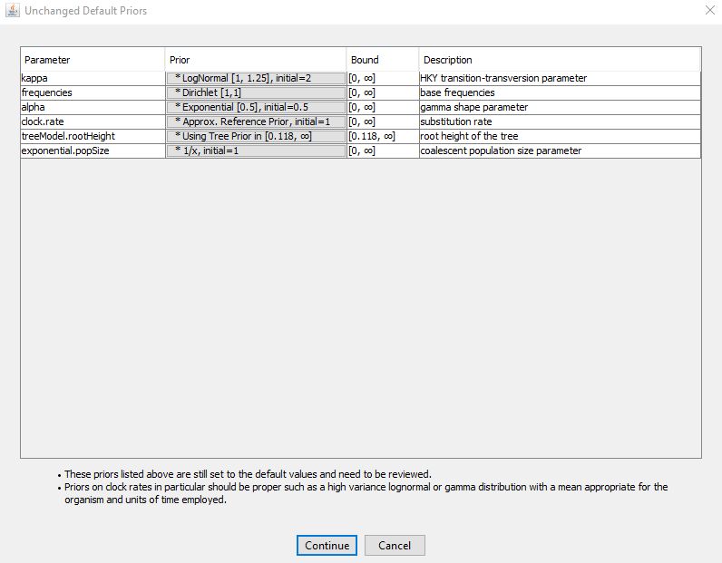
</p>

Once these last checks have been carried out, 
just click `Continue` and choose a name for the file and the location where you want to save 
it. We suggest you create a specific directory where you will want this analysis,  
e.g., `influenza_ex1`. Note that `BEAUti` will suggest the name you typed
in the `MCMC` tab as the filename. In addition, you will see that the extension ".xml" is used.

>> **NOTE for Windows users**: you may want to give the file the extension ".xml.txt" to avoid 
>> possible issues.

It is recommended that you leave the `BEAUti` window open so that you can easily change the
values of specific parameters and generate a new `BEAST` XML file if needed.

## 2. Running `BEAST`

### A. Running `BEAST` using a graphical interface 
Once the `BEAST` XML file has been created, the analysis itself can be performed with
`BEAST`.
 
Run `BEAST` by double-clicking on the `BEAST` icon.
Once `BEAST` has started, a dialog box will appear. Press the button `Choose File...`
and navigate through your file system until you find the `BEAST` XML file that you have
just generated with `BEAUti`. You will see that there is already a seed number entered 
in option `Random number seed` - remember that this is the number you will need to remember 
to use if you want to reproduce the exact same results when running `BEAST` with this same 
dataset. We can leave the rest of the options as they appear by default and then press `Run`. 

<p align="center">
  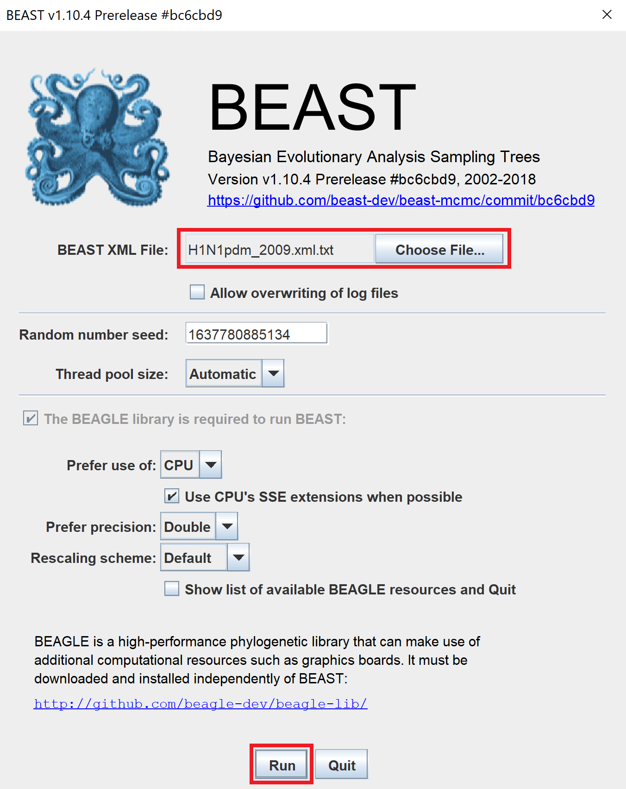
</p>

The analysis will then be performed with detailed information about the progress of the run being
written to the screen (second window that pops up when executing `BEAST`):

<p align="center">
  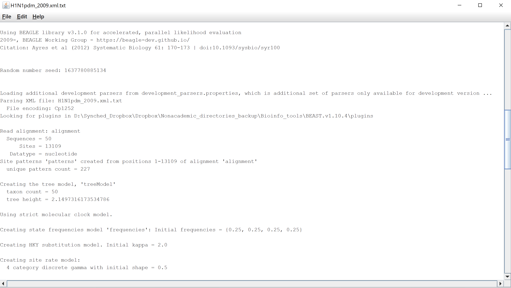
</p>

When it has finished, the log file and the trees file will have been created in the same location as your
XML file. 

For more information about the other options in the BEAST dialog box see
[this page](https://beast.community/beast).

### B. Running `BEAST` using the command line 
If you want to use the command-line to run `BEAST`, you need to make sure that you have installed the 
`beagle` library and that you have `Java` running on your PC.

To install the `beagle` library, you can follow the instructions detailed 
[here](https://github.com/beagle-dev/beagle-lib), which cover the installation on Windows, Linux, and Mac OSX.
These instructions include a test that you should run to make sure that the libary has been installed. 
If you pass the test, this means that the installation has been successful!

To check if you have `Java` installed, open a terminal from any location and type the following: 

```sh 
java -version
```

Two examples of the kind of message that you should see when running the command above are 
displayed (i.e., Windows users when using the Windows Linux Subsystem or when using 
the Windows PowerShell):

```
# WLS users...
openjdk version "1.8.0_152-release"
OpenJDK Runtime Environment (build 1.8.0_152-release-1056-b12)
OpenJDK 64-Bit Server VM (build 25.152-b12, mixed mode)

# Windows PowerShell users...
java version "16.0.1" 2021-04-20
Java(TM) SE Runtime Environment (build 16.0.1+9-24)
Java HotSpot(TM) 64-Bit Server VM (build 16.0.1+9-24, mixed mode, sharing)
```

Once you make sure that you have `Java` running on your PC and that you have installed the `beagle` library, 
you can open a terminal where you have saved your `BEAST` XML file. If you have not exported 
the path to the `beast.jar` executable file (i.e., file you can find under `BEAST.v1.10.4/lib/beast.jar`), you 
will need to run the software using either an absolute or a relative path. For instance:

```sh
# Run from the location where you have the `BEAST` XML file you created with `BEAUti`
# Windows users might have file `H1N1pdm_2009.xml.txt`, while UNIX/Linux users might 
# have saved it as `H1N1pdm_2009.xml`. Please, modify the command below according to your OS.
# Please note that this relative path might change on your PC! You should change this accordingly.
java -jar ../../../../../../../../../Nonacademic_directories_backup/Bioinfo_tools/BEAST.v1.10.4/lib/beast.jar  H1N1pdm_2009.xml.txt
```

Alternatively, you can create an alias to run `beast.jar` to avoid typing an absolute or a relative path to
execute it. For that purpose, you can add the following to your `~/.bashrc` or `~/.bash_profile`, the one 
you use in your system. Open them with your preferred text editor (e.g., `nano`, `vim`) and then add the 
following: 

```sh 
# Open the file. Below we have chosen to use `vim`,
# but you can choose other text editors such as `nano`. 
# Change the command below accordingly.
vim ~/.bashrc 

# Create alias to run `beast.jar`.
# Please replace "<path_to_BEAST>" with the absolute path
# to the location where you have saved `BEAST`.
# Modify the name of the directory that you have unzipped
# if needed too (e.g., `BEAST.v1.10.4`).
alias beast1.10.4='java -jar <path_to_BEAST>/BEAST.v1.10.4/lib/beast.jar'
``` 

Once you have saved and sourced this file (e.g., `source ~/.bashrc` or `source ~/.bash_profile`), you 
can execute `beast.jar` by using a much simpler command: 

```sh 
# Run from the location where you have the `BEAST` XML file you created with `BEAUti`
# Windows users might have file `H1N1pdm_2009.xml.txt`, while UNIX/Linux users might 
# have saved it as `H1N1pdm_2009.xml`. Please, modify the command below according to your OS.
beast1.10.4  H1N1pdm_2009.xml.txt
```

## 3. Analysing the BEAST output
 
To analyse the results of running `BEAST`, we are going to use the program `Tracer`.
Run `Tracer` by double clicking on the `Tracer` icon. If you want to run `Tracer` from 
the command line, you can either set an alias in your `~/.bashrc` or `~/.bash_profile` 
file (for more details on setting up aliases, please see the section above), run it from
the directory where the `jar` file can be found, or execute this `jar` file 
using an absolute or a relative path to the directory where the terminal is running.
Below, you can find a summary of how you would proceed for each of these three options 
when using the terminal:

```sh 
# Option 1: Run from the directory where 
# `tracer.jar` can be found. For instance, 
# if you open a terminal from
# `Tracer_v1.7.1/lib`, then:
java -jar tracer.jar


# Option 2: Use an absolute or a relative 
# path to execute the file. An example of 
# an absolute path is shown below:
java -jar Applications/Tracer_v1.7.1/lib/tracer.jar

# Option 3: Add an alias in your 
# `~/.bashrc` or `~/.bash_profile.
# Please replace "<path_to_Tracer>" with the absolute path
# to the location where you have saved `Tracer`
# Modify the name of the directory that you have unzipped
# if needed too (e.g., `Tracer_v1.7.1`)
alias tracer1.7.1='java -jar <path_to_Tracer>/Tracer_v1.7.1/lib/tracer.jar'
# Now, open a terminal from any location on 
# your PC and type the following command to 
# execute `Tracer`. Before you do this, please 
# make sure that you have X11 installed or, if 
# you are on Windows, that you have the Xming 
# Server running on your PC.
# If you are on Windows, you might need to run 
# the command `export DISPLAY=:0.0` before 
# you can execute `Tracer`
tracer1.7.1
```

Select the `Import Trace File...` option from the `File` menu. Select the
log file that was output by `BEAST`, `H1N1pdm_2009.log`. Alternatively, 
you can drag the log file to the `Tracer`. Then, the file will load and
you will be presented with a window similar to the one below:

<p align="center">
  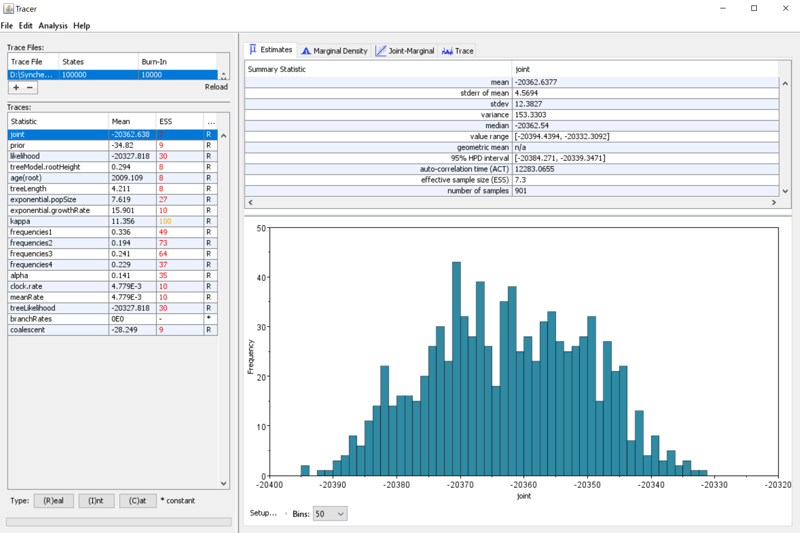
</p>
 
The effective sample sizes (ESSs) for all the traces are small - note that ESSs
less than 100 are highlighted in red by `Tracer`. In the bottom right of the window,
you can see a frequency plot of the samples. 
If we select the tab on the right-hand-side labelled `Trace` we can view the raw
trace — the sampled values against the step in the MCMC chain:

<p align="center">
  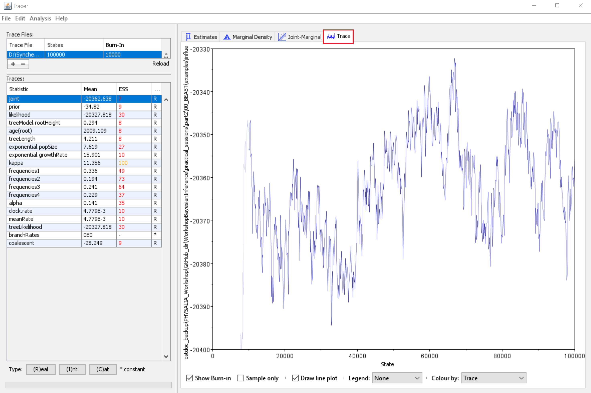
</p>

Here, you can see a burn-in of 10% might not be enougho as the values do not estabilise 
(more or less) until 40,000 samples have been collected. You can double-click on the
`Burn-In` column in the top left and edit (in this case, you can type 40,000). 
However, it is still clear that a chain length of 100,000 was not enough. By looking at the
ESS values (generally in the low double-digits), you can see that, despite they 
are larger than before, they are still very low,
even lower than or equal to 100 (remember that a value equal to or larger than 
200 is accepted in Bayesian inference in phylogenomic analyses):

<p align="center">
  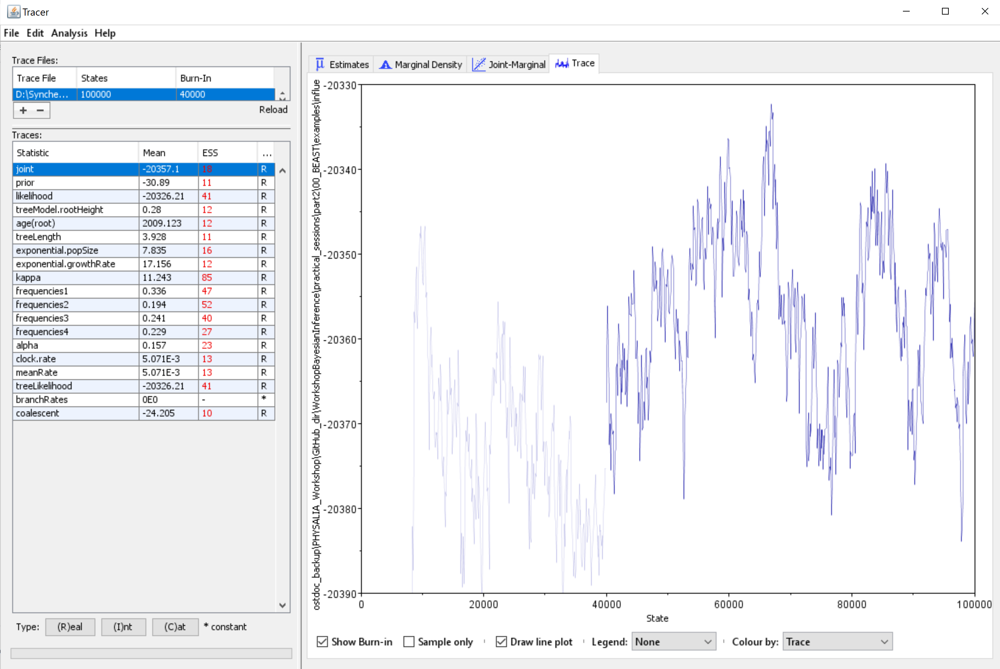
</p>

Therefore, we will need to run this chain longer (e.g., 10,000,000 iterations) to get a 
better ESS for the model parameters. You can change the length of the chain in `BEAUti`
(hopefully you have not closed the window yet and you can just modify this option without 
having to repeat the whole procedure from scratch!)
and run this in the background. As it might take a while to run, you can use the log file
[`H1N1pdm_2009_longchain.log`](examples/influenza_longchain_PC_20000/H1N1pdm_2009.log.txt),
which is the result of running a longer chain, 
so you can continue with the next sections of this tutorial! 

Load the new log file into `Tracer` (you can leave the window with the results obtained 
when running the chain  one loaded for comparison). Click on the `Trace` tab and look at
the raw trace plot.

<p align="center">
  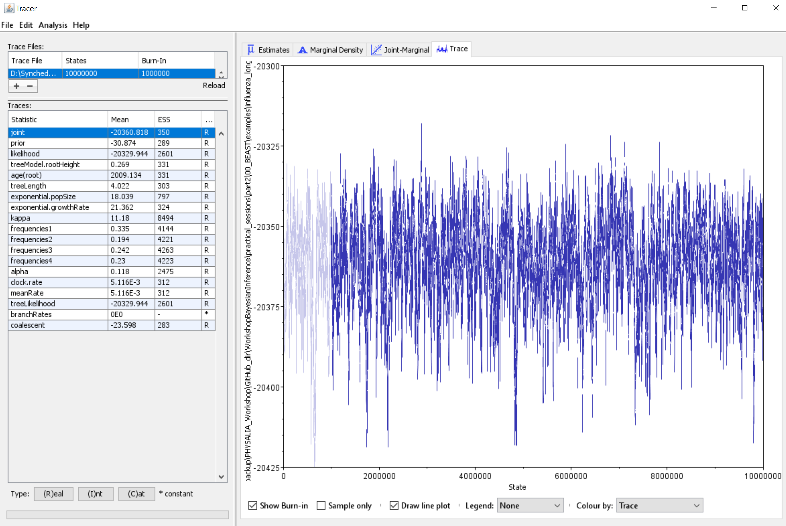
</p>


In addition, you can see that the ESS for all parameters sampled is larger than 200.
The ESS for the coalescent model parameters shows that there is little auto-correlation
between the samples. There are no obvious trends in the plot which would suggest that
the MCMC has not yet converged, and there are no large-scale fluctuations in the trace
which would suggest poor mixing. As we are satisfied with the behavior of the MCMC,
we can now move on to one of the parameters of interest: exponential growth rate for the 
coalescent model we chose as the tree prior. Select `exponential.growthRate` in the
left-hand table. Now choose the density plot by selecting the tab labeled
`Marginal Prob Distribution`. This will display a plot of the posterior probability
density of this parameter. You should see a plot similar to this:

<p align="center">
  
</p>

As you can see, the posterior probability density is roughly bell-shaped. The default is
to show the kernel density estimate (KDE) which is smoothed probability density fitted
to the data. Switch the `Display:` option at the top to `Histogram` to see the
unsmoothed frequency plot. There is still some noise, but it is a good estimate
of the distribution.

<p align="center">
  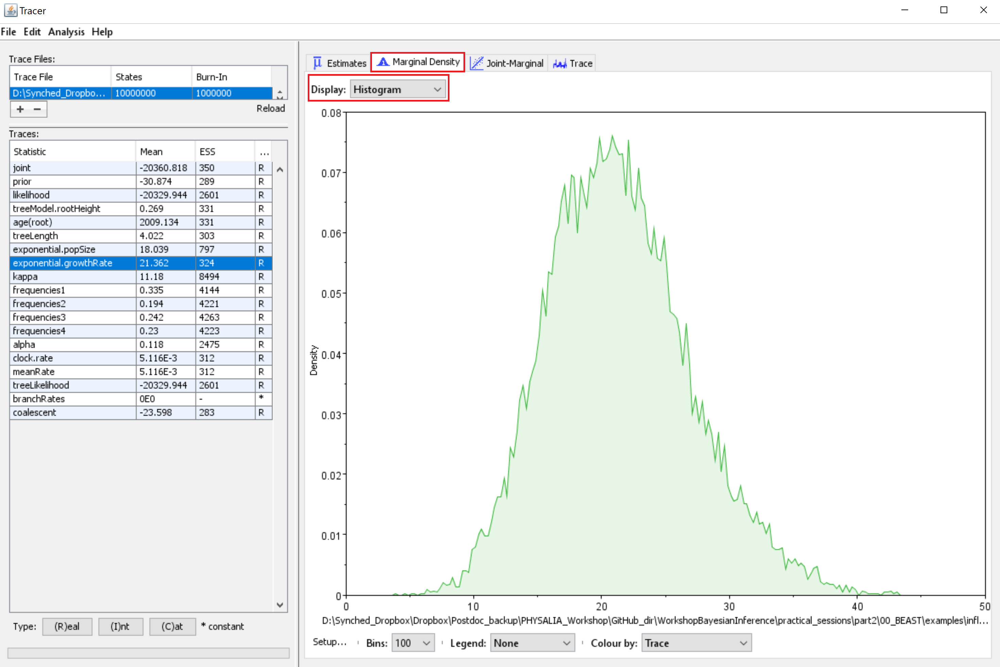
</p>

>> **QUESTION**   
>> The `age(root)` statistic provides an estimate of the time of the most recent common
>> ancestor of the entire tree. In this example, this can be a reasonable estimate of the
>> start of the epidemic, so we can estimate when the virus jumped from pigs into humans.
>> Which is the mean estimate and 95% HPDs for the date of the MRCA?

<p align="center">
  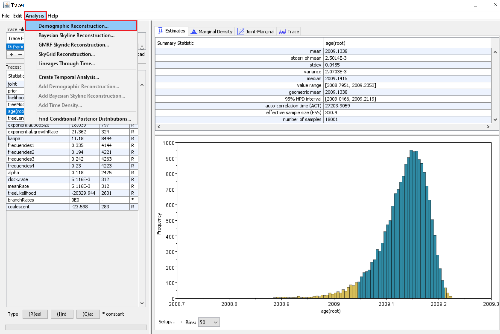
</p>

You can also visualize the growth estimate using the `Demographic Reconstruction...` 
option in the `Analysis` menu. Now, select the following options in the dialog box that will pop up:   

<p align="center">
  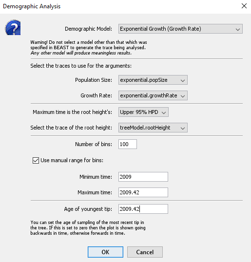
</p>

When you select `Demographic Model: Exponential Growth (Growth Rate)`,
`Tracer` will automatically identify the parameters of the model you have 
selected (in this example, `exponential.popSize` and `exponential.growthRate`) -- 
remember that you must select the tree prior you defined in `BEAUti`, you can’t change
these settings here!

For option `Maximum time is the root height's:`, you should pick `Upper 95% HPD`,
which will extend the reconstruction back to the extent of the root age credible interval.

Last, you can set option `Age of youngest tip:` to 2009.403 (the date of the most recently
sampled virus). You can also `Use manual range for bins:` to make the time-scale a bit
cleaner — choose 2009.0 to 2009.42. Then press `OK` and a window like the next one 
will appear:
 
<p align="center">
  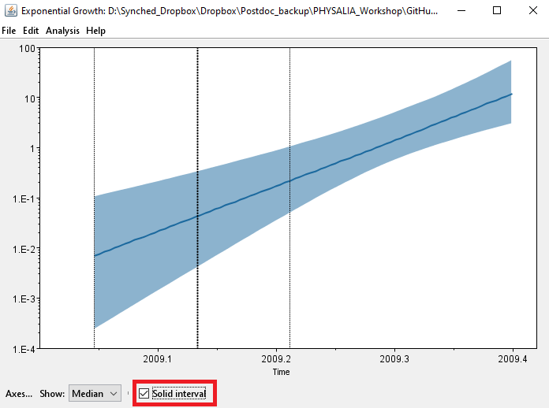
</p>

This shows the exponential growth line for the median growth rate and the 95% HPD
intervals for this growth as a solid area. It is on a log scale so is a straight line.
You can play with the axis settings using the `Setup...` button. The dotted vertical
lines represent the 95% HPD for the date of the root of the tree.

>> **NOTE**:   
>> The `exponential.growthRate` ($r$) provides an estimate of the epidemic growth of 
>> H1N1pdm 2009. Given that $N\times t=N_{0}\times exp^{-rt}$ (with $N_{0}$ being the population
>> size at present), the doubling time for $r=21$ is about 0.03 years or 12 days.
>> Interestingly, it has been shown that the basic reproductive ratio $R_{0}$ is related
>> to the growth rate — see [this page](https://beast.community/estimating_R0.html) for details. However, the basic reproductive
>> number is dependent not just on an estimate of $r$, but also a good estimate of the
>> generation time distribution, which reflects the time between successive infections
>> in a chain of transmission. If we assume a generation time distribution that follows
>> the gamma distribution, then $R_{0}=(1+r/b)^a$, where $a$ and $b$ are the parameters
>> of the gamma distribution (and $a=\mu^2/\sigma^2$, $b=\mu/\sigma^2$).

>> **QUESTION**:   
>> Taking $\mu=3$ days and $\sigma=2$ days, what would be the mean estimate of
>> $R_{0}$ for the H1N1pdm 2009 $R_{0}$?


## 4. Summarising the trees
We have seen how we can diagnose our MCMC run using `Tracer` and produce estimates of
the marginal posterior distributions of parameters of our model. Next we can use the 
`TreeAnnotator` tool that is provided as part of the `BEAST` package to summarize the
information contained within our sampled trees.
 
Run `TreeAnnotator` by double clicking on the executable file.
`TreeAnnotator` takes a single "target" tree and annotates it with the summarized
information from the entire sample of trees. The summarized information includes the
average node ages (along with the HPD intervals), the posterior support and the average
rate of evolution on each branch (for relaxed-clock models where this can vary).
The program calculates these values for each node or clade observed in the specified 
"target" tree.

Set the option `Burnin (as states):` to 1,000,000. This is 10% of the chain and we
previously confirmed with `Tracer` (see above) that this was adequate for our dataset.
Use the defaults for the rest of the options, i.e., `Posterior probability limit: 0.0`,
`Target tree type: Maximum clade credibility tree`, and `Node heights: Median heights`.

Use the `Choose File...` button to select the input file, `H1N1pdm_2009.trees`. If you 
had not started `TreeAnotator`, you could drag this file onto the icon as you can do 
with `Tracer` to load the dataset onto this program. Once the file is loaded, 
you can select a name for the output tree file (e.g., `H1N1pdm_2009.out.tree`). 
Then, you can press the `Run` button. 

<p align="center">
  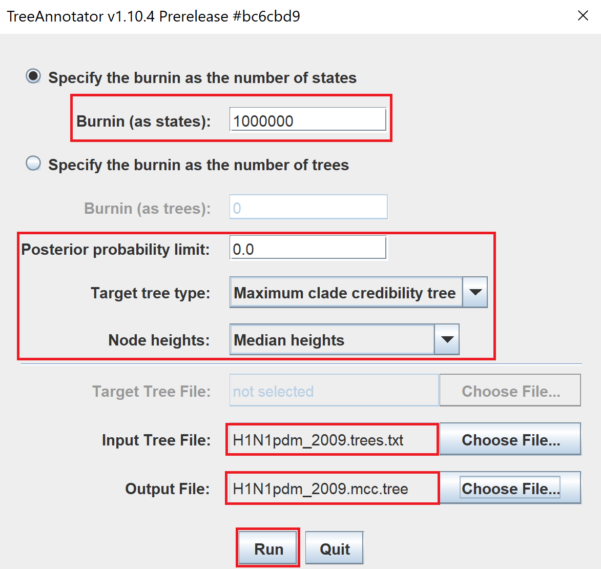
</p>

`TreeAnnotator` will analyse the input tree file and write the summary tree to the file
you specified. 

<p align="center">
  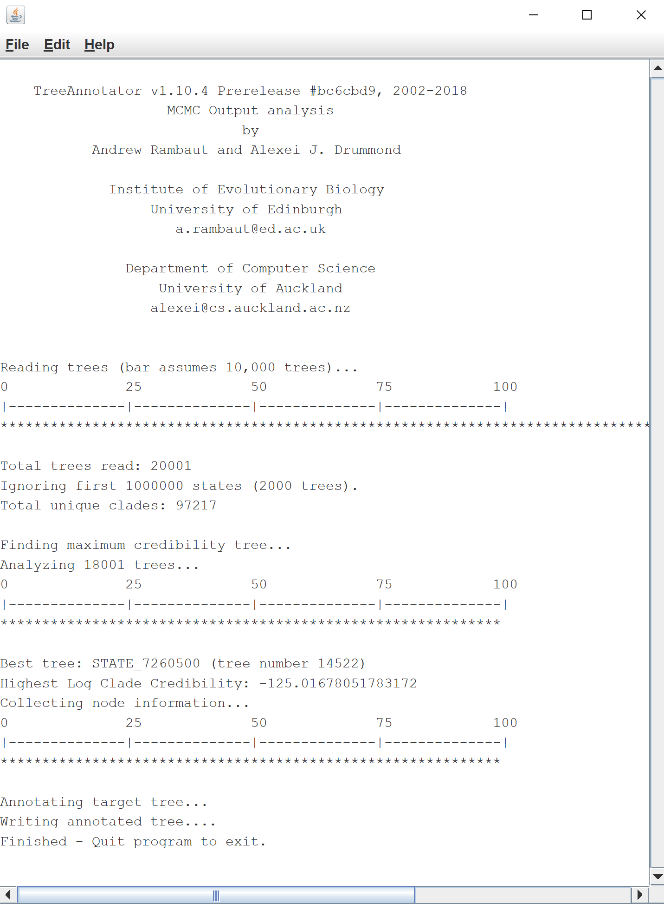
</p>

This maximum clade credibility (MCC) tree is in NEXUS format, which means that you can 
load it into any tree drawing software that supports this format. In addition, it contains 
additional information that can only be displayed if you use `FigTree`, so we will 
use this program (see section below).

## 5. Viewing the annotated tree
 
`FigTree` is a user-friendly, graphical program for viewing trees and the associated
information provided by `BEAST`. If you want to run `FigTree` from 
the command line, you can either set an alias in your `~/.bashrc` or `~/.bash_profile` 
file (for more details on setting up aliases, please see the section above), run it from
the directory where the `jar` file can be found, or execute this `jar` file 
using an absolute or a relative path to the directory where the terminal is running.
Below, you can find a summary of how you would proceed for each of these three options 
when using the terminal:

```sh 
# Option 1: Run from the directory where 
# `figtree.jar` can be found. For instance, 
# if you open a terminal from
# `FigTree_v1.4.4/lib`, then:
java -jar figtree.jar


# Option 2: Use an absolute or a relative 
# path to execute the file. An example of 
# an absolute path is shown below:
java -jar Applications/FigTree_v1.4.4/lib/figtree.jar

# Option 3: Add an alias in your 
# `~/.bashrc` or `~/.bash_profile.
# Please replace "<path_to_FigTree>" with the absolute path
# to the location where you have saved `FigTree`
# Modify the name of the directory that you have unzipped
# if needed too (e.g., `FigTree_v1.4.4`)
alias figtree1.4.4='java -jar <path_to_Tracer>/FigTree_v1.4.4/lib/figtree.jar'
# Now, open a terminal from any location on 
# your PC and type the following command to 
# execute `FigTree`. Before you do this, please 
# make sure that you have X11 installed or, if 
# you are on Windows, that you have the Xming 
# Server running on your PC.
# If you are on Windows, you might need to run 
# the command `export DISPLAY=:0.0` before 
# you can execute `FigTree`
figtree1.4.4
```

Now, you can open in `FigTree` the file with the MCC tree that you created with
`TreeAnnotator` in the previous section (remember that you can also drag the tree
file an place it onto the icon to start `FigTree` and load the tree file!).
The tree will be displayed in the `FigTree` window. On the left hand side of the
window are the options and settings which control how the tree is displayed. In this 
example, we want to display the posterior probabilities of each of the clades present
in the tree and estimates of the age of each
node. In order to do this, you need to change some of the settings.

First, re-order the node order (option `Order nodes`) by `Ordering: decreasing` under
the `Tree` menu. Switch on `Branch Labels` in the control panel on the left and open its
section by clicking on the arrow on the left. Now, select `posterior` under the
`Display:` option and reduce `Sig. Digits` to `2`.

Now, we want to display bars on the tree to represent the estimated uncertainty in the
date for each node. `TreeAnnotator` will have placed this information in the tree file
in the shape of the 95% highest posterior density (HPD) credible intervals. Switch on 
`Node Bars` in the control panel and open this section; select `height_95%_HPD` to
display the 95% HPDs of the node heights.

In addition, we can plot a time scale axis for this evolutionary history. Switch on 
`Scale Axis` (and switch off `Scale bar`) and select `Reverse Axis` in the `Scale Axis`
options (you can also increase the font size a bit). For appropriate scaling, open the
`Time Scale` section of the control panel, set the `Offset:` to `2009.403` (the date of
our most recently sampled virus).

In summary, you should have defined the settings as shown in the figure below:
<p align="center">
  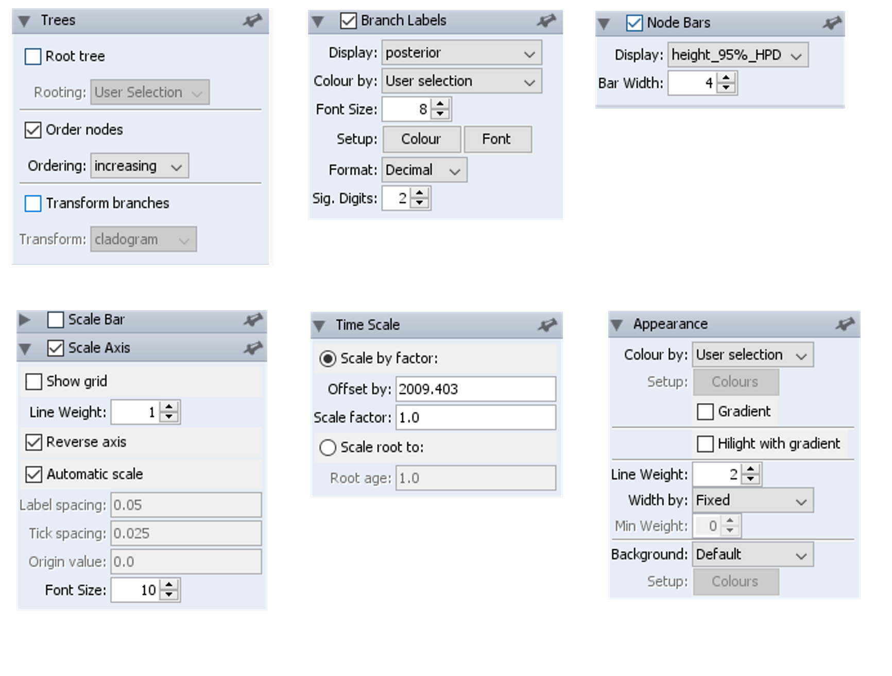
</p>

Finally, open the `Appearance` panel and alter the `Line Weight` to draw the tree with
thicker lines. The resulting tree will look like this:

<p align="center">
  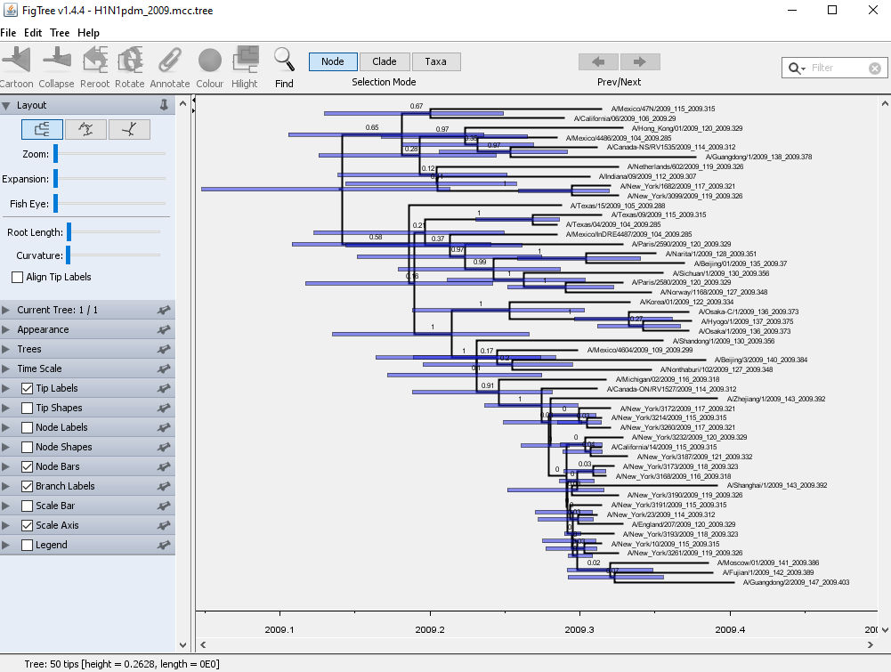
</p>
 
None of the options actually alter the tree's topology or branch lengths, so
feel free to explore other options and settings to see the different ways you 
can display the inferred tree. You can also export the tree (Newick, Nexus, and JSON formats 
available) by clicking `File>Export Trees...`, which will save most of your settings
so that, when you load it again into `FigTree`, you will be able to display the tree
almost exactly as you can see it now. The tree can also be exported to a graphics file
(pdf, svg, png, jpg). Apart from this, 
you can also save the project in `FigTree` so you all the settings can be restored when
you open the project again in `FigTree` (`File>Save as...`).

