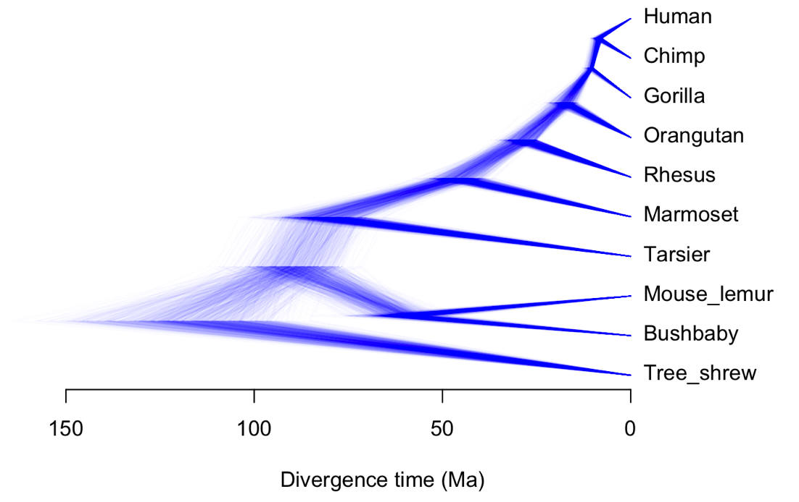
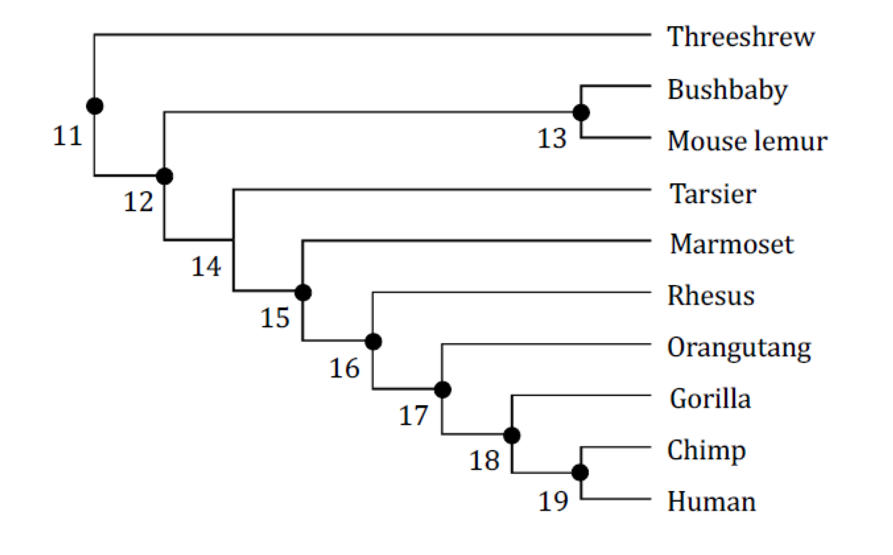
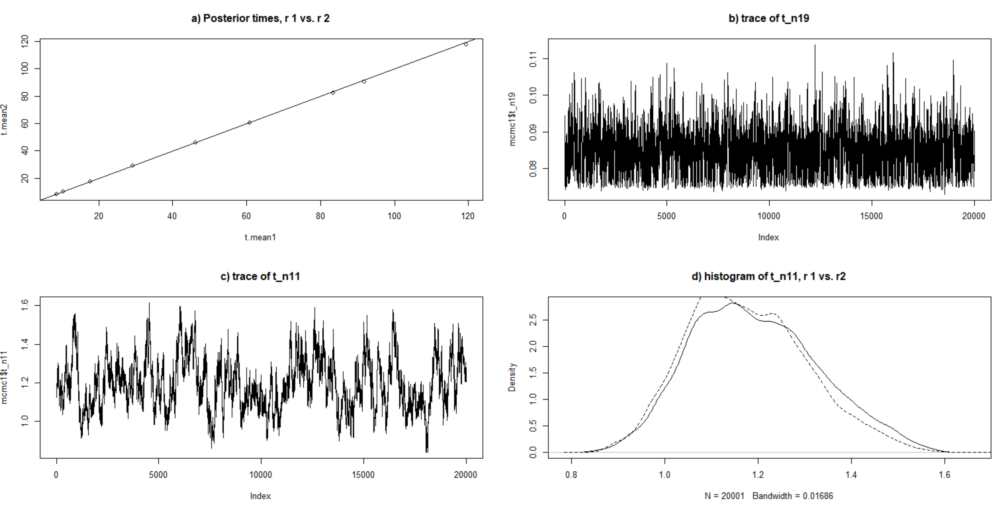
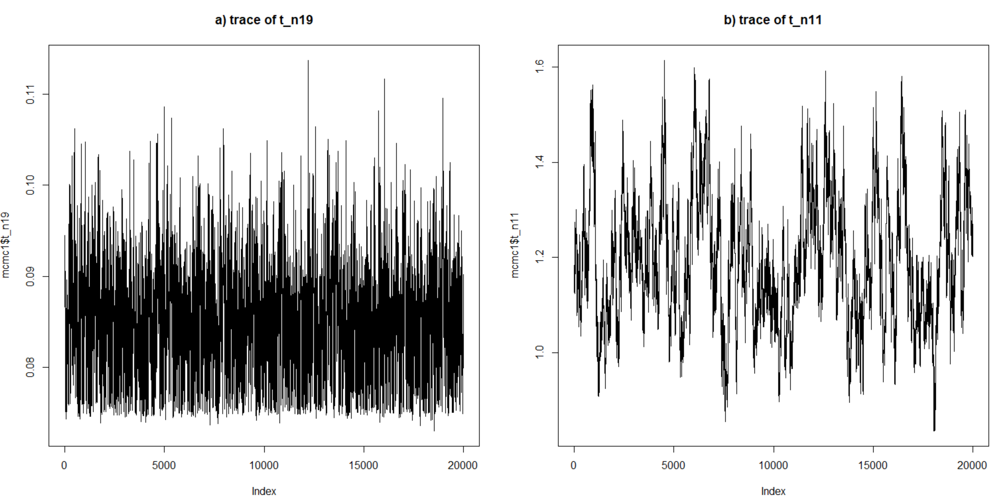
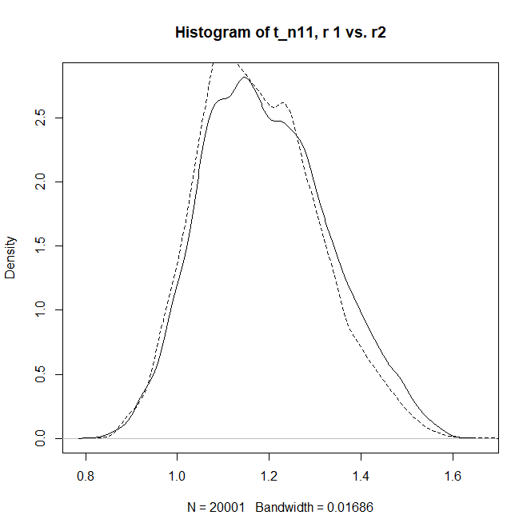
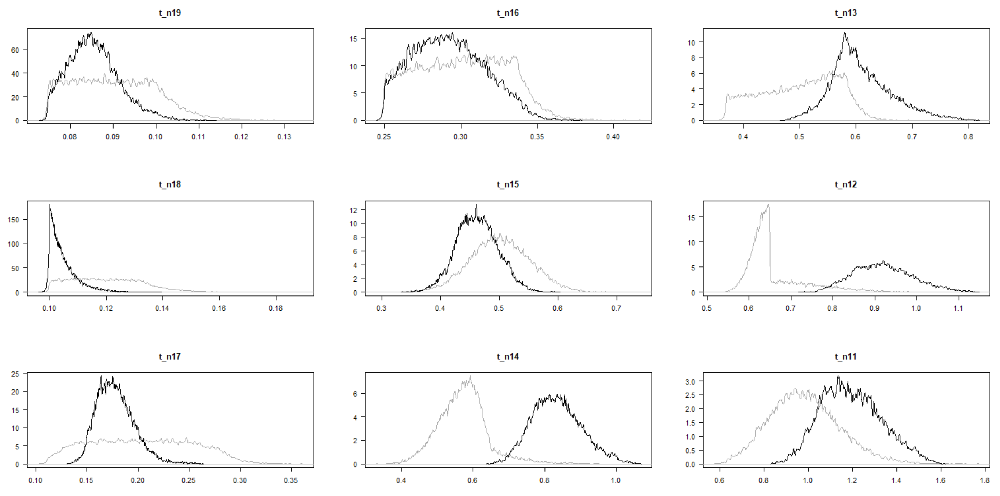

# `MCMCtree` TUTORIAL: Bayesian clock-dating using the approximate likelihood

> **IMPORTANT NOTE**: The tutorial we are going to be going through is based on the chapter 
> "Bayesian molecular clock dating using genome-scale datasets"
> ([dos Reis and Yang, 2019](https://link.springer.com/protocol/10.1007%2F978-1-4939-9074-0_10)), which 
> code and dataset can also be found [here](https://github.com/mariodosreis/divtime).
> Then, uncompress this file in your preferred location - remember where you have saved 
> the uncompress directory as it contains the datasets we will be using.

## 1. Introduction 

### Installing the software 
To run this tutorial, you will need to use `MCMCtree` and `BASEML`, two 
programs that are part of the PAML package for phylogenetic analysis 
([Yang 2007](https://academic.oup.com/mbe/article/24/8/1586/1103731)).
You can run this tutorial on the cluster as the latest version of PAML has 
already been installed. Nevertheless, if you want to run it on
your PC, please make sure that you have properly installed PAML and 
exported the path to `MCMCtree` and `BASEML` executable files so you can 
run these software from any location of your PC. You can download the latest 
version of PAML [here](http://abacus.gene.ucl.ac.uk/software/paml.html#download).

### Downloading the data 
To download the data, please clone the
[`divtimes` GitHub repository](https://github.com/mariodosreis/divtime). You can do it 
either using the command line (i.e., open a terminal on the location you want to 
clone the repository and type `git clone https://github.com/mariodosreis/divtime`) or by 
downloading a compressed file of the repository. For the latter, you can
automatically start the download by clicking [here](https://github.com/mariodosreis/divtime/archive/refs/heads/master.zip).
If the link does not work, you can go the
[`divtimes` GitHub repository ](https://github.com/mariodosreis/divtime), 
press the green button `Code` and then select `Download ZIP` to start the download. 
Then, just uncompress this file in your preferred directory to start going through 
the tutorial.

### What will you be doing? 
You will estimate the divergence times of 9 primates and 1 
scandentian (which we will use as an outgroup in our phylogeny). To do this, you 
will use an alignment of ~3 million nucleotides (i.e., few taxa but a very long alignment!)

If time allows, you will also analyse a dataset of 330 mammal species (276 primates and 
4 outgroups) with a shorter alignment. In this case, you will be able to see what 
happens when there are a lot of taxa but the alignment is shorter (i.e., if the 
alignment was a matrix, here you will have more rows than columns if compared to 
the first dataset described in this section).

<!--
<p align="center">
  
</p>
-->


>> **Figure 1**. Densitree of the 10 mammals species that you will analyse in this tutorial.
>> The script [`analysis.R`](https://github.com/mariodosreis/divtime/blob/master/R/analysis.R)
>> has been used to generate this figure.

## 2. Understanding the data 

### Tree and fossil calibrations 
The tree with the 10 mammal species that has been mentioned above has the 
following topology:

<!--
<p align="center">
  
</p>
-->


>> **Figure 2**. Tree of 10 species used in this tutorial. The nodes that have been calibrated 
>> using the information from the fossil record (see Table 1 below) are indicitaed with 
>> black dots. *_Note_*: This is Figure 1 in 
>> [dos Reis and Yang, 2019](https://link.springer.com/protocol/10.1007%2F978-1-4939-9074-0_10).

Note that not all internal nodes have been calibrated, only those that have a black 
dot in Figure 1. The calibrations that have been used are detailed below in Table 1:


> **Table 1**. List of fossil calibrations used to calibrate the phylogeny displayed in Figure 1.

| Node |  Group         | `MCMCtree` calibrations                                |          
|------|----------------|--------------------------------------------------------|
| 19   | Chimp-Human    | `B(0.075, 0.10, 0.01, 0.20)`                           |       
| 18   | Gorilla-Human  | `B(0.10, 0.132, 0.01, 0.20)`                           |      
| 17   | Hominidae      | `B(0.112, 0.28, 0.01, 0.10)`                           |     
| 16   | Catarrhini     | `B(0.25, 0.29, 0.01, 0.10)`                            |      
| 15   | Anthropoidea   | `ST(0.4754, 0.063, 0.98, 22.85)`                       |   
| 13   | Strepsirrhini  | `B(0.38, 0.58, 0.01, 0.10)`                            |      
| 12   | Primates       | `S2N(0.698, 0.65, 0.0365, –3400, 0.650, 0.138, 11409)` |
| 11   | Euarchonta     | `G(36, 36.9)`                                          |

Note that the notation used to define the calibrations in `MCMCtree` has the following meaning: 

   * **B(a, b, p<sub>L</sub>, p<sub>U</sub>)**: this notations means that the calibration used is a 
   **uniform distribution** which minimum value is _a_ and its maximum value is _b_.
   Value p<sub>L</sub> and p<sub>U</sub> indicate that the true node ages has probabilities
   p<sub>L</sub> and  p<sub>U</sub> of being outside the calibration bounds, that is, outside the
   range between _a_ and _b_.   
   * **ST(location, scale, shape, df)**: this means that the calibration is a **skew-_t_ distribution**, which 
   parameters are location (χ), scale (ω), shape/slant (α), and degrees of freedom (ν).   
   * **S2N(p, location1, scale1, shape1, location2, scale2, shape2)**: this means that the calibration is 
   _p_: 1 - _p_ **mixture of two skew-normal distributions**.   
   * **G(α, β)**: this means that the calibration is a **gamma distribution** with shape α and rate β.   

The time unit is 100 million years. For instance, for calibration `B(0.075,0.10)`, this means 
that 0.075 is equivant to 7.5 and 0.10 to 10 million years. Therefore, as this is format defines 
a uniform distribution, if the time unit is 100 million years, this calibration would be translated 
as **"this age of this node is constrained to be between 7.5 and 10 million years ago"**. 
  
More details about the format of these distributions on the PAML tutorial in the `MCMCtree` section. 
Note that these calibrations were those used in
[dos Reis et al. 2018](https://academic.oup.com/sysbio/article/67/4/594/4802240).

### Molecular alignment 
The molecular alignment that you will be using in this tutorial, file `10s.phy`,
consists of 5,614 protein-coding genes from 10 mammal taxa (see Figure 1). 
If you open file `10s.phy` with your preferred text editor, you will not find any gaps
(i.e., there are no `-` in the 
alignment). This is because all ambiguous codon sites were removed and, consequently, there are no
missing data in this alignment.

In addition, this alignment is separated into two partitions:   

   * Partition 1: All the first and second codon positions (12CP, a total of 2,253,316 base pairs).   
   * Partition 2: All third codon positions (3CP, a total of 1,126,658 base pairs).   

Note that this alignment is a subset of a larger 36-taxon alignment used in 
[dos Reis et al., 2012](https://royalsocietypublishing.org/doi/10.1098/rspb.2012.0683?url_ver=Z39.88-2003&rfr_id=ori:rid:crossref.org&rfr_dat=cr_pub%20%200pubmed), but also see 
[dos Reis et al. 2018](hhttps://academic.oup.com/sysbio/article/67/4/594/4802240). 

>> **NOTE**: This alignment has been compress into site patterns to save disk space!

## 3. Review of the Bayes' theorem and the approximate likelihood

### The Bayes' theorem applied to phylogenomics
We want to obtain the posterior distribution of the divergence times (**t**) and the 
molecular evolutionary rates (**r**, _μ_, _σ_<sup>2</sup>) for the species in the phylogeny 
displayed in Figure 1. Here:   

   * **t**: vector with the divergence times in this phylogeny (i.e., we have _n_ = 10 species,
   therefore we have _n_ - 1 = 9 divergence times).   
   * **r**: 16 molecular rates (one per branch and partitition, i.e., 8 branches in the tree and
   2 partitions in the molecular data).   
   * _μ_: 2 mean rates, one for each partition.   
   * _σ_: 2 log-variance of the rates, one for each partition.   
   
The posterior distribution in this case is the following:   

<!-- ∝ this is the proportional symbol! -->
_f_(**t**,**r**,_μ_,_σ_|_D_) ∝ _f_(**t**) _f_(**r**|**t**,_μ_,_σ_<sup>2</sup>) _f_(_μ_) _f_(_σ_<sup>2</sup>) _f_(_D_|**r**,**t**)

   > Prior on times: _f_(**t**)    
   > Prior on the branch rates, mean rates, and log-variances of the rates: _f_(**r**|**t**,_μ_,_σ_<sup>2</sup>) _f_(_μ_) _f_(_σ_<sup>2</sup>)   
   > Likelihood of our molecular alignment: _f_(_D_|**r**,**t**)   

Remember that the **prior on the times** is constructed by combining the birth-death process 
with the fossil calibration densities (see 
[Rannala and Yang, 2007](https://academic.oup.com/sysbio/article/56/3/453/1657118) for more details). 
Then, the **prior on the rates** is constructed assuming a model of rate evolution. In this tutorial, we assume 
that the branch rates are independent draws from a log-normal distribution with mean 
_μ_<sub>i</sub> and log-variance _σ_<sub>i</sub><sup>2</sup>.

### Method to approximate the likelihood
In a Bayesian phylogenetic analysis using MCMC, we need to calculate the
likelihood (_f_(_D_|**r**,**t**)) for each site pattern on the molecular alignment 
(e.g., even though an alignment
might have 2,000,000 sites, there might only be 1,200,000 sites, and thus the likelihood would 
only be computed once for each site pattern, so extra time is saved) 
Consequently, calculating the likelihood is the most demanding computation during the MCMC, which 
is proportional to the number of site patterns the alignment has: the longer the alignment, the 
more time it will take to infer the timetree. If you have a phylogenomic dataset, computation 
becomes prohibitive. 

`MCMCtree` implements an approximation to the likelihood 
that speeds computation time substantially, making analysis of genome-scale date feasible.
The approximate likelihood method for clock dating was proposed by
[Thorne et al. 1998](https://pubmed.ncbi.nlm.nih.gov/9866200/) and implemented in `MCMCtree`
[dos Reis and Yang, 2011](https://pubmed.ncbi.nlm.nih.gov/21310946/).
The method relies on approximating the log-likelihood surface
on the branch lengths by its Taylor expansion (see the technical details in 
[dos Reis and Yang, 2019](https://link.springer.com/protocol/10.1007%2F978-1-4939-9074-0_10)).

To use this approximation, the tree topology of the phylogeny of interest is **fixed**.
Then, `MCMCtree` **estimates the branch lengths for each alignment partition** on the **fixed tree** by **maximum likelihood**.
The **gradient** and the **Hessian** of the log-likelihood are calculated for each partition at 
the same time as the maximum likelihood estimates (MLEs) of the branch lengths. 
The parameters of the substitution model (e.g., transition/transversion ratio, κ, in the 
HKY moel or the α parameter of the discrete-gamma distribution that is used to model 
rate heterogeneity among sites) are estimated at this step. 
Consequently, different substitution models will generate **DIFFERENT** approximations as they 
will have **different MLEs** for the branch lengths, gradient, and Hessian. 

You can use the number of species in your alignment to estimate how long computing the approximation of the likelihood
will take, as this is what determines the size of the vector for the branch lengths and the Hessian.
This means that, once the gradient and the Hessian have been calculated, MCMC sampling on the 
approximation takes the same time regardless the length of the original alignment.

The steps that we will follow when running `MCMCtree` and `BASEML` are the following:   

   1. Calculate the gradient and the Hessian. Both `MCMCtree` and `BASEML` are used, but note 
   that it is `BASEML` the software that will be used to compute the gradient and the Hessian. 
   At this step, you need to **choose the substitution model**.   
   2. Use `MCMCtree` to estimate the posterior distribution of times and rates.   
   3. Carry out MCMC diagnostics to check that the chain has converged.   
   4. Sample from the prior to make sure that there is no conflict between the effective prior (the 
   prior distribution that `MCMCtree` is using) and the user-specified prior (the prior distribution 
   that the user specified in the control file). In this case, the data (molecular alignment) are not used 
   as we just want to check that the prior on times that `MCMCtree` is using is not different 
   from the prior the user has told `MCMCtree` to use (i.e., we want to make sure there is no conflict).   
   

## 4. Hands-on: let's estimate our timetree!
At this point, we assume that you have cloned the `divtimes` directory as all the commands
that you will go through below refer to the file architecture that you will find 
in this GitHub repository. Let's get started!

### A. Calculate the gradient and the Hessian 
Go to the directory `gH` and open with your preferred text editor the `mcmctree-outBV.ctl`
control file. Here, you define all the options that `MCMCtree` needs to calculate the 
gradient and the Hessian, which you will later use to approximate the likelihood 
calculation to infer your timetree:

```
       seqfile = ../data/10s.phys 
      treefile = ../data/10s.tree

         ndata = 2
       seqtype = 0    * 0: nucleotides; 1:codons; 2:AAs
       usedata = 3    * 0: no data (prior); 1:exact likelihood; 
                      * 2: approximate likelihood; 3:out.BV (in.BV)
         clock = 2    * 1: global clock; 2: independent rates; 3: correlated rates

         model = 4    * 0:JC69, 1:K80, 2:F81, 3:F84, 4:HKY85
         alpha = 0.5  * alpha for gamma rates at sites
         ncatG = 5    * No. categories in discrete gamma

     cleandata = 0    * remove sites with ambiguity data (1:yes, 0:no)?
```

Note that `seqfile` and `treefile` have the relative path to the 
molecular alignment and the calibrated phylogeny, respectively (this holds if you 
have not changed anything when you have cloned the GitHub repository!). 

The option `ndata` defines that you have two partitions in your molecular alignment and 
`seqtype` specifies that your data is nucleotide data. 

The most important option here is `usedata`. The first option, `0`, is the one that you 
will use at the end when you are to run the MCMC but, instead of sampling from the 
posterior, you will be sampling from the prior to assess that there is no conflict between 
the user-specified prior and the effective prior that `MCMCtree` is using. The 
second option, `1`, is use the exact likelihood calculation during the MCMC when 
sampling from the posterior. The third option, `2`, is used to sample from the posterior using 
the approximate likelihood, the option that you need to use **only**
once you have calculated the gradient and the Hessian (they are needed to calculate the 
approximate likelihood and, without them, this option does not work!). 
The option that you want to use now, however, is the last one: `3`. This option prepares 
the data in a format that `BASEML` can compute the gradient and the Hessian (i.e., `MCMCtree` will 
call `BASEML` to carry out the latter task). 

The options `model`, `alpha`, and `ncatG` 
are used to setup the HKY85+G model (the last two enable the usage of the gamma distribution 
with parameter α=0.5, `alpha`, and 5 categories, `ncatG`, to account for rate heterogeneity).

Finally, the option `cleandata` tells `MCMCtree` if our dataset has ambiguous sites and, if so,
if they should be removed (`1`) or not (`0`). As we have mentioned above, our dataset does not 
have ambiguous site. Therefore, we can set `cleandata=0` but, essentially, this option has no 
effect on our dataset.

To start the analysis, open the terminal again inside directory `gH` and run:

```sh 
mcmctree mcmctree-outBV.ctl
```

This will start `MCMCree`. As soon as it starts, you will several `tmp*` files: these are 
the files that `MCMCtree` is preparing for `BASEML`. Once these files are ready, `MCMCtree` 
will call `BASEML` so it estimates the gradient and the Hessian. Once this analysis has finished,
you will see that you have a file called `out.BV` in this directory. Part of this file will look 
similar to the following (i.e., `[...]` indicates that the row continues):

```

 10

((Bushbaby: 0.029523, Mouse_lemur: 0.019653): 0.006547, (Tarsier: 0.030898, (Marmoset: 0.015183,      [...]

  0.006547  0.029523  0.019653  0.002123  0.030898  0.011754  0.015183  0.003426  0.008716  0.002160  [...]

  9.960475  3.772246 11.602107 -33.688924  4.356691 -4.022599  2.743008 -10.615630  0.205429 -55.319  [...]


Hessian

 -2.033e+08  -2.59e+06 -9.717e+06 -4.363e+07  1.799e+06 -5.457e+06  2.055e+06 -1.285e+04  3.483e+06   [...]
  -2.59e+06  -5.71e+07  2.235e+06  1.475e+06  3.315e+06  1.651e+06  3.436e+06  2.134e+06  4.548e+06   [...] 
 -9.717e+06  2.235e+06 -8.733e+07 -2.954e+06   2.79e+06  7.275e+05  3.371e+06  1.512e+06  4.413e+06   [...]
 -4.363e+07  1.475e+06 -2.954e+06 -4.622e+08 -5.058e+06 -2.658e+07  3.701e+06 -5.156e+06 -1.405e+05   [...] 
  1.799e+06  3.315e+06   2.79e+06 -5.058e+06 -5.473e+07  7.951e+05  3.437e+06   2.28e+06  4.463e+06   [...] 
 -5.457e+06  1.651e+06  7.275e+05 -2.658e+07  7.951e+05 -1.403e+08  3.724e+06 -1.163e+07  2.246e+06   [...]
  2.055e+06  3.436e+06  3.371e+06  3.701e+06  3.437e+06  3.724e+06  -1.25e+08  -1.69e+07  1.979e+06   [...] 
 -1.285e+04  2.134e+06  1.512e+06 -5.156e+06   2.28e+06 -1.163e+07  -1.69e+07 -4.756e+08  1.698e+06   [...] 
  3.483e+06  4.548e+06  4.413e+06 -1.405e+05  4.463e+06  2.246e+06  1.979e+06  1.698e+06  -2.33e+08   [...] 
  8.345e+05  2.861e+06  2.023e+06  1.605e+06  2.021e+06 -5.676e+05 -8.424e+05 -1.722e+07 -2.082e+07   [...] 
  3.625e+06  4.671e+06  4.894e+06   8.94e+05  4.775e+06  2.595e+06  1.699e+06  5.407e+05  -5.98e+05   [...] 
  2.701e+06  3.036e+06  2.394e+06  1.777e+06  3.175e+06  6.218e+05 -5.952e+05 -4.592e+06 -1.057e+06   [...] 
  4.513e+06  4.423e+06  4.718e+06  3.323e+06  4.183e+06  5.625e+05  2.304e+06 -1.523e+06  1.949e+06   [...] 
 -8.548e+04   3.81e+06  2.646e+06 -8.578e+06  3.267e+06 -1.264e+06 -1.538e+06 -7.398e+06 -4.532e+06   [...] 
  4.283e+06  5.151e+06  4.151e+06  3.478e+06  4.869e+06  3.483e+06  2.344e+06 -2.633e+06 -9.036e+05   [...] 
  3.303e+06  5.308e+06  5.045e+06 -2.962e+06  3.738e+06  2.037e+06 -2.992e+05 -1.883e+05 -3.698e+06   [...] 
  1.239e+06  3.101e+06  2.448e+06 -4.451e+06   2.52e+06  1.286e+06   3.39e+06  1.976e+06  4.201e+06   [...] 

 10

((Bushbaby: 0.122995, Mouse_lemur: 0.081318): 0.029161, (Tarsier: 0.134090, (Marmoset: 0.058280,       [...]

  0.029161  0.122995  0.081318  0.009121  0.134090  0.053974  0.058280  0.014562  0.031662  0.009954   [...]

 -0.036197  0.097445  0.000000 -0.184581 -0.016424 -0.024300  0.048402 -0.378657 -0.151209 -1.111183   [...]


Hessian

 -1.551e+07   -4.6e+05  -1.44e+06 -5.207e+06  1.063e+05 -9.333e+05  3.277e+05       6558  3.932e+05   [...] 
   -4.6e+05 -5.339e+06 -3.974e+04       8287  2.637e+05  1.799e+05  3.469e+05  3.308e+05  3.995e+05   [...] 
  -1.44e+06 -3.974e+04 -8.163e+06 -6.349e+05  2.236e+05     -501.7  3.642e+05  2.479e+05  4.242e+05   [...] 
 -5.207e+06       8287 -6.349e+05 -3.074e+07 -5.541e+05 -2.976e+06  4.184e+05 -5.644e+05  2.031e+05   [...] 
  1.063e+05  2.637e+05  2.236e+05 -5.541e+05 -4.885e+06 -1.192e+05   3.73e+05  2.468e+05   4.18e+05   [...] 
 -9.333e+05  1.799e+05     -501.7 -2.976e+06 -1.192e+05  -1.15e+07  3.177e+05 -1.678e+06  1.072e+05   [...] 
  3.277e+05  3.469e+05  3.642e+05  4.184e+05   3.73e+05  3.177e+05 -1.412e+07 -3.986e+06  1.794e+05   [...] 
       6558  3.308e+05  2.479e+05 -5.644e+05  2.468e+05 -1.678e+06 -3.986e+06 -4.175e+07 -6.124e+04   [...] 
  3.932e+05  3.995e+05  4.242e+05  2.031e+05   4.18e+05  1.072e+05  1.794e+05 -6.124e+04 -2.923e+07   [...] 
  2.405e+05  3.507e+05  3.118e+05  1.715e+05  3.413e+05 -8.764e+04 -5.495e+05 -2.646e+06 -5.061e+06   [...] 
  3.937e+05  3.765e+05  4.692e+05  3.125e+05  4.213e+05  9.325e+04  -9.04e+04 -4.943e+05 -3.992e+05   [...] 
      3e+05  3.559e+05  2.917e+05  1.473e+05  3.043e+05 -1.348e+05 -1.815e+05 -7.059e+05 -8.258e+05   [...] 
  4.411e+05  4.258e+05  5.268e+05  3.044e+05  4.272e+05 -1.826e+05  1.078e+04 -6.575e+05 -6.811e+04   [...] 
  3.947e+05   3.21e+05  4.209e+05 -1.308e+05  4.622e+05 -3.263e+05 -3.051e+05 -1.262e+06 -9.867e+05   [...] 
  3.871e+05  5.114e+05  4.979e+05  3.235e+05  4.522e+05 -4.206e+04 -7.207e+04 -1.041e+06 -2.892e+05   [...] 
  3.301e+05   3.98e+05  4.302e+05  6.594e+04  3.943e+05 -4.055e+04 -2.852e+05  -8.32e+05 -6.216e+05   [...] 
  1.051e+05  2.703e+05  2.014e+05 -4.242e+05  2.231e+05  1.274e+05  3.497e+05  2.718e+05  3.962e+05   [...] 
```

First, you will notice that you have the similar information repeated twice: the gradient and the Hessian have 
been computed for each partition **in the order they appear in the molecular alignment**. The order is very important
as they have to specifically match the same position they are found in the `out.BV` file and in your molecular alignment,
here `10s.phy` as the branch lengths, the gradient, and the Hessian have been compute specifically for each 
partition. If you change the order, the approximation will be wrong.

The content of the `out.BV` file for each partition is the following: 

First, you will see the number of taxa (lines 2 and 31, `10`). Then, you will see the tree with the estimated
branch lengths by maximum likelihood. Next, we have the MLEs of the 17 branch lengths (these are the same as in the 
tree you have above, but they are just printed in a different order). Then, we have the gradient, which is the 
vector of first derivateives of the likelihood at the branch length MLEs for the first partition (remember that, in 
our alignment, `10s.phy`, the first partition has the first and the second codon positions). If the dataset is 
samall, you will expect the gradient to be usually zero. For large datasets, the likelihood surface is too sharp, which 
means that the surface bends downwards sharply and it is very narrow at the MLEs. This means that the gradient is not 
zero for numerical issues, but that is expected and should be fine. 
After this vector, you will see the Hessian matrix for the first partition, which is the matrix of second derivatives
of the likelihood at the branch length MLEs for partition 1. Then, you will find the same content but now estimated for 
the second partition: the alignment with third codon positions.

### B. Estimate the posterior of times and rates
Now that you have the gradient and the Hessian estimated for each partition, you can run `MCMCtree` to infer the timetree!
Copy the `gH/out.BV` file now in the `mcmc` director and rename it `in.BV`:

```sh
# From directory `gH` 
cp out.BV ../mcmc/in.BV 
```

Now, go to the `mcmc` directory and run the `mcmctree.ctl` file, which is the control file that now will 
run `MCMCtree` using the approximate likelihood. Note that there are some differences between this control file 
and the one you used before:

```
          seed = -1
       seqfile = ../data/10s.phys 
      treefile = ../data/10s.tree
      mcmcfile = mcmc.txt
       outfile = out.txt

         ndata = 2
       seqtype = 0    * 0: nucleotides; 1:codons; 2:AAs
       usedata = 2    * 0: no data (prior); 1:exact likelihood; 
                      * 2:approximate likelihood; 3:out.BV (in.BV)
         clock = 2    * 1: global clock; 2: independent rates; 3: correlated rates
       RootAge = '<1.0'  * safe constraint on root age, used if no fossil for root.

         model = 4    * 0:JC69, 1:K80, 2:F81, 3:F84, 4:HKY85
         alpha = 0.5  * alpha for gamma rates at sites
         ncatG = 5    * No. categories in discrete gamma

     cleandata = 0    * remove sites with ambiguity data (1:yes, 0:no)?

       BDparas = 1 1 0   * birth, death, sampling
   kappa_gamma = 6 2     * gamma prior for kappa
   alpha_gamma = 1 1     * gamma prior for alpha

   rgene_gamma = 2 40 1   * gammaDir prior for rate for genes
  sigma2_gamma = 1 10 1   * gammaDir prior for sigma^2     (for clock=2 or 3)

         print = 1   * 0: no mcmc sample; 1: everything except branch rates 2: everything
        burnin = 20000
      sampfreq = 100
       nsample = 20000
```

First of all, you have an option to set a seed number, `seed`, which is very important 
for you to reproduce the same results! Option `-1`, which is the one we use by default, will tell 
`MCMCtree` to use the system's clock time as the seed. Nevertheless, you can change this value 
if you want to use a specific seed number.

Then, you have options `mcmcfile` and `outfile`, which respectively let `MCMCtree` know the 
path to the file where all the sampled parameters will be output (i.e., `mcmc.txt`, which will be saved 
in the same directory where this control file is located) and path to the file where some of the screen 
messages and the summary of the sampled values for the parameters of interest are to be printed out
(i.e., `out.txt`, which will also be saved in the same directory where this control file is located). 

As we mentioned above, the option `usedata` now will take value `2` because you have already calculated 
the gradient and the Hessian, which are saved in file `in.BV`. By default, `usedata` assumes that this file 
is called `in.BV` and is located in the same directory as the control file. Nevertheless, if this was not 
the case, you would need to specify this as `usedata = 2 <path_to_inBVfile>.BV`.

Then, the option `clock` is used to define that we will be using a log-normal distribution from which the samples will be 
independently drawn during the MCMC (value `2`). 

The next option, `RootAge`, is not used anymore within the control file. Instead, this calibration is included
in the tree file -- make sure that the file `10s.tree` has a calibration for the root age! So, what you should 
do now, is delete this line in the control file and save the changes.

The options `model`, `alpha`, and `ncatG` have been defined in the same way you did in the first step when 
you wanted to estimate the gradient and the Hessian. As you are using the approximate likelihood and this 
nucleotide substitution model has been used in the previous step to compute these parameters, they will not have 
any effect in this step. 

The next options are very important because they are going to define the prior distributions for 
the model parameters! 

   1. Prior on the times: option `BDparams` defubes the prior distribution for those nodes without fossil calibrations.
   Specifically, this distribution models the birth-death process. In this example, we are going to use λ = μ = 1 (values for the 
   birth and rate parameters, respectively) and ρ = 0 (sampling parameter). These parameters define a uniform 
   distribution between present time and the age of the root, which is the distribution that will be used as a prior on the times.   
   2. Prior on κ (transition/transversion ratio of HKY85 model): this prior is a gamma distribution with values 
   α = 6 and β = 2 (i.e., mean value of κ is around α/β = 3). We are using the approximate likelihood calculation so,
   for this analysis, this prior **does not have any effect**.   
   3. Prior on α (shape parameter of discrete gamma distribution to account for rate heterogeneity): this prior is
   gamma distribution with values α = 1 and β = 1 (i.e., mean value of α is around α/β = 1). We are using the
   approximate likelihood calculation so, for this analysis, this prior **does not have any effect**.   
   4. Prior on the evolutionary rate _r_: this prior is a gamma-Dirichlet distribution on the mean substitution rate 
   for the partitions. The mean evolutionary rate is estimated to be α/β = 2/40 = 0.05 substitutions per time (100 My, our 
   time unit in the calibrations, see Table 1), according to the parameter values
   that define this prior. The third value of this gamma-Dirichlet distribution, `1`, is the concentration parameter, which
   is used to spread the rate prior across partitions.   
   5. Prior on the rate variance _σ_<sup>2</sup>: this prior is a gamma-Dirichlet prior with mean α/β = 1/10 = 0.1. As in 
   the prior on the evolutionary rate, the Dirichlet is used to spread the prior across partitions.   
   
The final block of options is used to define the settings of the MCMC. The option `print` is normally set to `1` as
choosing `2` will translate into more computational time (it prints the branch rates too). Only use `print = 2` if you 
really need the branch rates to be printed out. Then, you can define the number of samples you want to discard 
as a burn-in phase (`burnin`), the frequency with which you want to sample the values of the parameters of interest 
(`sampfreq`), and the number of samples you want to collect (`nsample`). In this example, our MCMC chain will run a total 
of 20,000 (burn-in) + 20,000 (collected samples) · 100 (sampling frequency) = 2,020,000 iterations.

Now, you are ready to run `MCMCtree`! If you are not yet in directory `mcmc`, go to this 
directory and type the following command:

```sh 
mcmctree mcmctre.ctl 2>&1 | tee log_MCMCtree.txt
``` 

This will start the MCMC sampling and will save a log file valled `log_MCMCtree.txt` with the messages that you will 
see printed on the screen of the terminal. During the first 20,000 iterations, `MCMCtree` will fine-tune the step sizes 
to propose parameter values in the chain. Once this burn-in phase is finished, the sampling from the posterior 
will start. You will see something like the following on your screen:

```

  0% 0.24 0.36 0.26 0.30 0.28  1.237 0.976 0.666 0.886 0.429 0.269 - 0.106 0.132 -17.0  0:01

(nsteps = 50)
Current Pjump:      0.23600  0.36275  0.26025  0.29625  0.28150  0.29700  0.29875  0.31225  [...]
Current finetune:   0.00418  0.00213  0.00471  0.00277  0.00489  0.00533  0.00655  0.00682  [...]  
New     finetune:   0.00319  0.00268  0.00401  0.00273  0.00455  0.00527  0.00651  0.00715  [...]  


  1% 0.33 0.23 0.34 0.29 0.31  1.192 0.994 0.661 0.906 0.465 0.280 - 0.107 0.130 -17.0
  2% 0.33 0.22 0.34 0.27 0.30  1.159 0.962 0.631 0.881 0.462 0.285 - 0.120 0.148 -17.0
  3% 0.34 0.24 0.34 0.28 0.29  1.187 0.937 0.612 0.853 0.459 0.289 - 0.128 0.154 -17.0
  4% 0.34 0.24 0.34 0.27 0.28  1.198 0.920 0.609 0.837 0.462 0.286 - 0.130 0.157 -17.0
  5% 0.34 0.25 0.34 0.27 0.28  1.251 0.921 0.603 0.837 0.462 0.286 - 0.131 0.157 -17.0  0:07

  6% 0.34 0.25 0.34 0.28 0.28  1.233 0.906 0.596 0.822 0.460 0.285 - 0.137 0.162 -17.0
  7% 0.33 0.25 0.34 0.27 0.28  1.200 0.895 0.584 0.811 0.458 0.284 - 0.142 0.171 -17.0
  8% 0.33 0.25 0.34 0.28 0.27  1.182 0.900 0.583 0.816 0.464 0.287 - 0.144 0.173 -17.0
  9% 0.34 0.25 0.35 0.28 0.27  1.171 0.912 0.584 0.827 0.464 0.289 - 0.144 0.173 -17.0
 10% 0.34 0.25 0.35 0.28 0.28  1.172 0.919 0.590 0.835 0.465 0.290 - 0.142 0.171 -17.0  0:14

 11% 0.34 0.25 0.34 0.27 0.28  1.168 0.922 0.599 0.837 0.464 0.290 - 0.139 0.168 -17.0
 12% 0.34 0.25 0.34 0.28 0.28  1.168 0.923 0.604 0.838 0.463 0.289 - 0.137 0.166 -17.0
 13% 0.34 0.24 0.34 0.27 0.28  1.180 0.924 0.607 0.840 0.464 0.291 - 0.136 0.165 -17.0
 14% 0.34 0.24 0.34 0.28 0.28  1.183 0.925 0.608 0.841 0.464 0.291 - 0.135 0.163 -17.0
 15% 0.34 0.25 0.34 0.28 0.28  1.185 0.924 0.608 0.839 0.464 0.291 - 0.135 0.163 -17.0  0:21

```

The first column on the left shows the sampling as a percentage of the total (i.e., 5% 
of the iterations completed, 10% of total iterations completed, etc.). Then, you have the 
acceptance proportions, which are close to 30% (this is the result of fine-tuning by `MCMCtree`, 
the blocks that you will see above this section:

```
(nsteps = 50)
Current Pjump:    
Current finetune: 
New     finetune: 
```

After the five acceptance proportions `MCMCtree prints the current values that are being sampled 
for some of the parameters that are to be estimated. The last negative value is the likelihood, which 
can be followed by the time taken so far every 5%.

Once this analysis has finished, you will need to run this analysis again -- remember that, at least, we 
need to run two chains so we can check for chain convergence! Therefore, we will rename the output 
files and the file with the seed number (so we can later reproduce it!):

```sh 
mv mcmc.txt mcmc1.txt
mv out.txt out1.txt
mv SeedUsed SeedUsed1
mv log_MCMCtree.txt log_MCMCtree_chain1.txt 
mv FigTree.tre FigTree1.tre
```

Once the output files are renamed, we can now rerun `MCMCtree` again. 

>> **IMPORTANT NOTE**: if you do not rename the files, they will be overwritten!

```sh 
mcmctree mcmctree.ctl 2>&1 | tee log_MCMCtree_chain2.txt
```

Now, you can rename the output files again for this second chain: 

```sh 
mv mcmc.txt mcmc2.txt 
mv out.txt out2.txt 
mv SeedUsed SeedUsed2 
mv FigTree.tre FigTree2.tre
```

>> **PRO TIP**: If you want to run two chains at the same time, you can create two directories 
>> where you have the necessary files saved and start `MCMCtree` simultaneously. 

The most important information in the `out1.txt` and `out2.txt` files can be found at the 
end: 

```
Species tree for FigTree.  Branch lengths = posterior mean times; 95% CIs = labels
(1_Tree_shrew, ((2_Bushbaby, 3_Mouse_lemur) 13 , (4_Tarsier, (5_Marmoset, (6_Rhesus, (7_Orangutan, (8_Gorilla, (9_Chimp, 10_Human) 19 ) 18 ) 17 ) 16 ) 15 ) 14 ) 12 ) 11 ;

(Tree_shrew: 1.194584, ((Bushbaby: 0.609112, Mouse_lemur: 0.609112): 0.309936, (Tarsier: 0.834186, (Marmoset: 0.461758, (Rhesus: 0.292109, (Orangutan: 0.177587, (Gorilla: 0.104619, (Chimp: 0.085471, Human: 0.085471): 0.019148): 0.072968): 0.114523): 0.169649): 0.372428): 0.084863): 0.275535);

(Tree_shrew: 1.194584, ((Bushbaby: 0.609112, Mouse_lemur: 0.609112) [&95%={0.517055, 0.734459}]: 0.309936, (Tarsier: 0.834186, (Marmoset: 0.461758, (Rhesus: 0.292109, (Orangutan: 0.177587, (Gorilla: 0.104619, (Chimp: 0.085471, Human: 0.085471) [&95%={0.0757798, 0.0988049}]: 0.019148) [&95%={0.0995151, 0.117729}]: 0.072968) [&95%={0.148709, 0.217168}]: 0.114523) [&95%={0.252677, 0.339107}]: 0.169649) [&95%={0.394626, 0.532039}]: 0.372428) [&95%={0.710712, 0.984537}]: 0.084863) [&95%={0.793887, 1.0695}]: 0.275535) [&95%={0.957277, 1.4797}];


Posterior mean (95% Equal-tail CI) (95% HPD CI) HPD-CI-width

t_n11          1.1946 (0.9573, 1.4797) (0.9639, 1.4844) 0.5204 (Jnode 18)
t_n12          0.9190 (0.7939, 1.0695) (0.7871, 1.0615) 0.2744 (Jnode 17)
t_n13          0.6092 (0.5171, 0.7345) (0.5142, 0.7303) 0.2161 (Jnode 16)
t_n14          0.8342 (0.7107, 0.9845) (0.7012, 0.9698) 0.2686 (Jnode 15)
t_n15          0.4618 (0.3946, 0.5320) (0.3942, 0.5315) 0.1373 (Jnode 14)
t_n16          0.2921 (0.2527, 0.3391) (0.2498, 0.3341) 0.0843 (Jnode 13)
t_n17          0.1776 (0.1487, 0.2172) (0.1465, 0.2139) 0.0674 (Jnode 12)
t_n18          0.1046 (0.0995, 0.1177) (0.0988, 0.1151) 0.0163 (Jnode 11)
t_n19          0.0855 (0.0758, 0.0988) (0.0749, 0.0964) 0.0216 (Jnode 10)
mu1            0.0268 (0.0219, 0.0333) (0.0215, 0.0326) 0.0111
mu2            0.1108 (0.0891, 0.1388) (0.0876, 0.1365) 0.0489
sigma2_1       0.1355 (0.0595, 0.2779) (0.0489, 0.2475) 0.1987
sigma2_2       0.1639 (0.0747, 0.3231) (0.0627, 0.2921) 0.2294
lnL          -17.0440 (-25.9680, -10.0180) (-25.4820, -9.6890) 15.7930
```

First, you have the species tree written in three formats: 

   1. Tree 1:  the nodes are labelled with the corresponding node numbers.This is useful so you can then
   check the age of each node according to its number.   
   2. Tree 2: the tree has the branch lengths in absolute time units.   
   3. Tree 3: this tree is like the second tree but now you see that the 95% confidence intervals of the node 
   ages have been included. 
   
Then, you have a table with all the estimated divergence times for each node, i.e., from node 11 to node 
19 (this is why tree 1 is useful!). After that, you have the estimated values for the mean substitution rates 
(`mu_1` and `mu_2`) and the rate variation coefficients for each partition (`sigma2_1` and `sigma2_2`). The last 
row of this table is log-likelihood (`lnL`). Note that this table includes the posterior means, equal-tail CIs,
and the high-posteior density CIs. For instance, the posterior age of the root, `t_n11`, is 
119.46 (95.73, 147.97) Ma (remember that time unit is 100 million years!).

You can use `FigTree` to visualise the two timetrees inferred for each run!

### C. MCMC diagnostics 
We have seen in the previous tutorial how to use `Tracer` to explore the sampled values during an MCMC. 
Now, we will use the `R/analysis.R` script to perform basic convergence tests.

First, we will load the posterior mean time estimates in `out1.txt` and `out.txt` in R and we wil plot 
them: run 1 vs run 2. In that way, if the plot shows that the points fall around the _y_ = _x_ line, 
we have an indicator that tells us that the chains have converged to the same distribution (which 
hopefully is the posterior distribution we wanted to approximate!).

<!--
<p align="center">
  
</p>
-->


>> **Figure 3**. Convergence plot for the chains ran in the previous step.
>> The script [`analysis.R`](https://github.com/mariodosreis/divtime/blob/master/R/analysis.R)
>> has been used to generate this figure.

As we have seen in the lectures, you can also calculate the effective sample size (ESS) as a useful statistic 
to have an idea about whether the MCMC has run long enough. We will be using the function 
`coda::effectiveSize` that is implemented in R, which differs a bit from the one implemented in `Tracer` (i.e., if you 
load the output files in `Tracer`, you might not get the same ESS). As we have discussed in previous 
lectures and practical sessions, the larger the ESS, the better. For phylogenomic analysis, we can be happy if
the ESS for all the parameters is equal to or larger than 200 (although this will not always be possible with very 
large datasets). Once you run commands from lines 37 to 41, you will see this table (you will have different 
values unless you have used the same seed number that we have!):

```
            mean.mcmc    ess.mcmc     var.mcmc      se.mcmc
t_n11      1.19461726    72.35728 1.842849e-02 0.0159589278
t_n12      0.91904218    58.71863 5.031167e-03 0.0092564921
t_n13      0.60916495   160.07811 2.898179e-03 0.0042549715
t_n14      0.83420300    65.69786 4.772635e-03 0.0085232166
t_n15      0.46176325   248.00573 1.231378e-03 0.0022282544
t_n16      0.29210826   325.89021 5.555429e-04 0.0013056390
t_n17      0.17759765   342.06876 3.244001e-04 0.0009738314
t_n18      0.10462219   964.24241 2.347371e-05 0.0001560263
t_n19      0.08547535  1189.95010 3.445843e-05 0.0001701702
mu1        0.02676770   395.05697 8.357112e-06 0.0001454448
mu2        0.11075470   436.55747 1.637127e-04 0.0006123792
sigma2_1   0.13545854  1149.41711 3.205079e-03 0.0016698618
sigma2_2   0.16386144   786.63122 4.150356e-03 0.0022969795
lnL      -17.04395170 20001.00000 1.693107e+01 0.0290948656
```

Here, you can see that the ESS for `t_n11`, `t_n12`, and `t_n14` is quite slow (even lower than 100).
If we were to increase the number of iterations, we might be able to increase the ESS for these 
parameters. We recommend you keep the same number of samples to 
collect and just increaes the sampling frequency!

At the same time, you can see that the larger the ESS, the smaller the standard deviation and 
the better the estimates are. For instance, for node 11 we have estimated a mean age of 119.46 with 
standard error of 1.60 million years. Therefore, we have estimated 
the mean accurately to within 2 · 1.60 = 3.2 million years. To reduce the standard error by hald, we 
would need to increase the ESS four times!!

As we have mentioned in the lectures, we can combine independent MCMC runs (IF THEY HAVE CONVERGED TO 
THE SAME DISTRIBUTION!) into a single run. In that way, we may save time by running several MCMC chains 
in parallel.

In addition, we can also plot the traces of the parameter values to assess chain convergence.
We can check the trace plots for those parameters with low/high ESS:

<!--
<p align="center">
  
</p>
-->


>> **Figure 4**. Trace plots for the estimated mean divergence times for nodes 11 and 19 for chain 1.
>> The script [`analysis.R`](https://github.com/mariodosreis/divtime/blob/master/R/analysis.R)
>> has been used to generate this figure.

The trace of node 19, which has a high ESS, looks like a "hairy caterpillar". Instead, the one for 
node 11, which has a low ESS, does not. Visual inspection of a trace plot usually gives a sense of whether 
the parameter has an adequate ESS without calculating it. Note that both traces are trendless, that is, the traces 
oscillate around a mean value (the posterior mean). If you see a persistend trend in the trace (such as an 
increase or a decrease), that most likely means that the MCMC did not converge to the posterior and needs 
a longer burn-in period. 

<!--
<p align="center">
  
</p>
-->


>> **Figure 5**. Histograms of chain 1 and 2 for values sampled to estimate the mean posterior time estimate for node 11.
>> The script [`analysis.R`](https://github.com/mariodosreis/divtime/blob/master/R/analysis.R)
>> has been used to generate this figure.

The histograms above are a bit different. As the ESS becomes larger, histograms for different runs will converge 
in shape until becoming indistinguishable. If you see large discrepancies between histograms, that may indicate 
serious problems with the MCMC, such as lack of convergence due to short burn-in or the MCMC getting stuck in different 
modes of a multi-modal posterior.

### D. MCMC sampling from the prior 
At the beginning of this tutorial, we showed you the fossil calibrations that we have used 
to calibrate the phylogeny in Figure 1 represented as statistical distributions in `MCMCtree` format
(see Table 1). `MCMCtree` uses these distributions to construct the prior on times. Nevertheless, sometimes 
the prior that `MCMCtree` uses (effective prior) is very different from the one that we as users have told 
this software to use based on the fossil record (user-specified prior). This might happen because the software 
applies a truncation so that daughter nodes are younger than their ancestors. Therefore, it is always good 
practice and highly recommended to calculate the time prior explicitly by running the MCMC **without data** (i.e., 
samples will be gathered from the prior and not from the posterior). In this way, we can then compare this prior 
against the posterior and the fossil calibrations we have used to build the prior calibrations. 

Now, go to the `prior` directory and type: 

```sh 
mcmctree mcmctree-pr.ctl 2>&1 | tee log_MCMCtree_prior1.txt
```

>> **NOTE**: You can open the control file with your preferred text editor. The most important change 
>> is `usedata = 0`, which specifies that no data should be used!

This command will start MCMC sampling from the prior. You will see that this analysis is very fast because the likelihood 
is not being calculated (no data are used!). Now, rename again the output files as you did before so you can repeat 
the analysis and run a second chain to check for convergence. 


<!--
<p align="center">
  
</p>
-->


>> **Figure 6**. Prior densities of node ages obtained by MCMC sampling (grey) VS the posterior densities (black).
>> The script [`analysis.R`](https://github.com/mariodosreis/divtime/blob/master/R/analysis.R)
>> has been used to generate this figure.

According to Figure 6 above, you can see that the posterior times "agree" with the prior for nodes 19, 18, 17, and 16.
This means that th eposterior density is contained within the prior density.
For nodes 15, 13, and 11, however, there is some conflict between the prior and the posterior densities.
For nodes 14 and 12, there is **substantial** conflict between the prior and the posterior: in both cases, the molecular data 
(together with the clock model) suggest the node age is much older than the implied by the calibrations. This highlights the 
problems in construction of fossil calibrations!

Remember that fossil calibartions represent the palaentologists's best guess about the age of a node. For instance, 
the caliration for the human-chimp ancestor is 
`B(0.75, 0.10, 0.01, 0.20)`. Thereforem the calibration is a uniform distribution between 7.5 and 10 million years. The bounds 
of this calibration are soft, which means that there is a probability that the bound can be violated. In this case, the probabilities 
are 1% for the minimum bound (0.75) and 20% for the maximum bound (0.10). The bound probabilities are asymmetrical because they 
reflect the nature of the fossil information. Minimum bounds are usually set with confidence because they are based on the age 
of the oldest fossil specimen of a clade. For instance, the minimum of 7.5 Ma is based on the age of _Sahelanthropus tchadensis_,
which is regarded as the oldest fossil within the human lineage. On the other hand, establishing maximum bounds is very
difficult, as absence of fossils for certain clades cannot be interpreted as evidence that the clade in question did not 
exist for a particular geological time. Our maximum here of 10 million years represents the palaentologist's informed guess 
about the likely oldest age of the clade. Nevertheless, a larger probability (20%) compared to the one used with the minimum is 
given to the maximum bound to allow for the fact that the node age could be older. The conflict between the prior and the  
posterior seen in Figure 6 above are proof of this conflict. 

Note that, when constructing the time prior, the Bayesian dating software must respect the constraints whereby daughter 
nodes must be younger than their parents. This means that calibration densities are truncated to accommodate this 
constraint, with the result that the actual prior used on node ages can be substantially different to the 
calibration density used. 

## 5. Exercises 

### 1. Autocorrelated rates model
Modify file `mcmc/mcmctree.ctl` and set `clock = 3`. This activates the
autocorrelated lognormal rates model, also known as the geometric Brownian motion
rates model. Run the MCMC twice and check for convergence. Compare the
posterior times obtained with those obtained under the independent log-normal model
(`clock = 2`). Are there any systematic differences in node age estimates between the
two analysis? Which clock model produces the most precise (i.e., narrower CIs)
divergence time estimates?

### 2. MCMC sampling with exact likelihood calculation
Modify file `mcmc/mcmctree.ctl` and set `clock = 2` (independent rates), `usedata = 1` (exact likelihood),
`burnin = 200`, `sampfreq = 2`, and `nsample = 500`.
These last three options will lead to a much shorter MCMC, with a total of 1,200
iterations. Run the MCMC sampling twice and check for convergence using the ESS,
histograms, and trace plots. How long does it take for the sampling to complete? Can
you estimate how long would it take to run the analysis using 2,020,000 iterations, as
long as for the approximate method you have used in the main part of this tutorial? Did the two chains converge
despite the low number of iterations?

### 3. Change fossil calibrations
There is some controversy over whether †Sahelantrhopus, used to set the minimum
bound for the human-chimp divergence, is indeed part of the human lineage. The next
(younger) fossil in the human lineage is †Orrorin which dates to around 6 Ma. Modify
file `data/10s.tree` and change the calibration in the human-chimp node to `B(0.057, 0.10, 0.01, 0.2)`.
Also, change the calibration on the root node to `B(542 0.615, 1.315, 0.01, 0.05)`.
Now, run the MCMC analysis
with the approximate method and again sampling from
the prior. Are there any substantial differences in the posterior distributions of times
under the new fossil calibrations? Which nodes are affected? How bad is the truncation
effect among the calibration densities and the prior?

### 4. Compare calibration densities and prior densities 
This is a difficult exercise. Use R to plot the prior densities of times sampled using MCMC.
Now try to work out how to overlay the calibration densities
onto the plots. First, write functions that
calculate the calibration densities. The `dunif` function in R is useful to plot uniform
calibrations. Functions `sn::dsn` and `sn::dst` (in the `sn` package) are useful to plot
the skew-_t_ (ST) and skew-normal (SN) distributions. Calibration type S2N (see Table 1) is a
mixture of two skew-normal distributions. How do the sampled priors compare to
the calibration densities? Are there any substantial truncation effects?

### 5. Time estimation in a super-matrix of 330 taxa 
Good taxon sampling is critical to obtaining robust estimates of divergence times for
clades. In the `data/` directory, an alignment of the 1st and 2nd codon positions from
mitochondrial protein-coding genes from 330 species (326 primate and 4 outgroup
species) is provided, `330s.phys`, with corresponding tree topology, `330s.tree`.
First, place the fossil calibrations of Table 1 on the appropriate nodes of the species tree.
Then obtain the gradient and Hessian matrix for the 330-species alignment using the
HKY+G model. Finally, estimate the divergence times on the 330-species phylogeny by
using the approximate likelihood method. 

How does taxon sampling affect node age
estimates when comparing the 10-species and 330-species trees? How does uncertainty
in node ages in the large tree, which was estimated on a short alignment, 566 compare with
the estimates on the small tree, but with a large alignment?

---

> **IMPORTANT NOTE**: If you are trying to run line 51 in the R script to read `10s.tree` and save it in 
> object `pri10s.tree` and it throws an error, try and run the following: 
> `pri10s.tree <- ape::read.tree( text = "(Tree_shrew,((Bushbaby,Mouse_lemur),(Tarsier,(Marmoset,(Rhesus,(Orangutan,(Gorilla,(Chimp,Human))))))));" )`.

